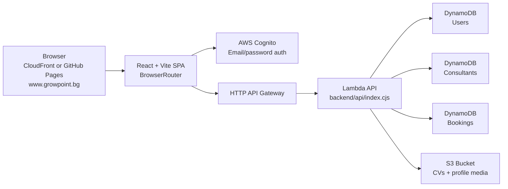

# GrowPoint

GrowPoint is a full-stack career platform for two main roles:

- users / professionals who want to build a profile, upload a CV, browse consultants, and request sessions
- consultants / mentors who want to publish a profile, upload profile media, manage availability, and receive booking requests

The project is intentionally split into three layers:

1. a static React + Vite frontend currently served from GitHub Pages, with S3 + CloudFront provisioned for cutover
2. a serverless AWS backend made of API Gateway + Lambda + DynamoDB + S3
3. Terraform infrastructure that creates and wires the AWS resources

This README is meant to explain the whole architecture in a practical, step-by-step way, so someone opening the repository can understand how the system works end to end.

## 1. High-Level Architecture



At runtime:

- GitHub Pages currently serves the static frontend from `/index.html` plus generated public route copies such as `/users/index.html`
- the S3 + CloudFront path serves the same SPA from a private S3 bucket and falls unknown routes back to `/index.html`
- the React app uses `BrowserRouter`; `scripts/site-build.mjs` writes static route entries so public routes return `200` on refresh
- Cognito handles login, registration, confirmation, and password reset
- the frontend calls the AWS HTTP API with a JWT token for protected routes
- the Lambda reads and writes data in DynamoDB
- uploads go directly to S3 through pre-signed URLs generated by the Lambda

### 1.1 Frontend Hosting Decision

GitHub Pages still serves `https://www.growpoint.bg` until DNS is cut over, but the AWS frontend hosting path is now prepared:

- private S3 bucket for the built React app
- CloudFront distribution with origin access control
- SPA fallback: unknown public/app paths return `/index.html` with `200`
- immutable caching for `/assets/*`
- no-cache behavior for HTML, sitemap, robots, and app shell files
- ACM certificate request in `us-east-1` for `growpoint.bg` and `www.growpoint.bg`

This removes the GitHub Pages limitation where every new consultant route needs a committed static folder to avoid a refresh `404`. After jethost.bg DNS is switched to CloudFront, a newly approved consultant URL can load immediately through the SPA fallback.

> DNS note: the `growpoint.bg` / `www.growpoint.bg` domain is registered and DNS-managed at **jethost.bg**, and currently resolves `www` to GitHub Pages (the live landing page). Any DNS records mentioned below (CloudFront cutover, ACM certificate validation, SES verification) must be created in the **jethost.bg** DNS panel.

Important SEO nuance:

- CloudFront/S3 solves live route loading.
- It does not automatically create fresh per-profile HTML metadata for brand-new profiles.
- `scripts/site-build.mjs` still generates `sitemap.xml` and static metadata snapshots from the live API during build.
- For perfect real-time SEO metadata per new profile, add a dynamic metadata renderer later, or schedule a regular CloudFront build/deploy after profile approvals.

## Production Feature Status and Roadmap

Last QA pass: 2026-06-07 on `https://www.growpoint.bg`, the CloudFront test domain, and the live AWS API.

This table is the current production-readiness map: what works, what still needs work, and what should be tested with real users next. Controlled live QA runs use disposable Cognito users, a disposable consultant profile, temporary S3 objects, and disposable bookings; the latest run removed those records afterwards and cleanup was verified.

### 2026-06-07 Production Hardening Pass

The latest pass focused on launch readiness, speed, and repo security:

- **Functional QA:** the full live lifecycle suite passed 27/27 — signup + resend + admin confirm, login, consultant profile save/approval/public route, avatar + cover upload, the full booking lifecycle, two-way booking messages, ICS, document sharing + privacy, past-session confirmation + review, and notifications. Disposable data was cleaned up.
- **Public profile SEO on CloudFront:** a CloudFront viewer-request function now resolves directory-style routes to their `index.html`, so known public routes serve route-specific metadata while unknown routes still fall back to the SPA shell.
- **Speed / cost:** public `GET /consultants` and `GET /consultants/{slug}` now send `Cache-Control: public, max-age=60, stale-while-revalidate=300`, so browsers and any CDN layer can serve repeat reads without hitting Lambda. Signed media URLs stay valid for 3600s, comfortably longer than the cache window.
- **Demo profiles:** example consultants are retained on purpose to keep the directory full and are clearly labeled with a "Пример" badge; their availability is refreshed to upcoming dates via `scripts/refresh-example-availability.cjs`.

### Security and Secrets (public repository)

This repository is public, so no secrets are committed:

- Real secrets live only in `infra/terraform/terraform.tfvars`, which is gitignored. Use `infra/terraform/terraform.tfvars.example` as the template.
- `.gitignore` ignores `.env` / `.env.*` (and `.env*.local`), `*.pem` / `*.key` / `*.p8` / `*.p12` / `*.pfx`, `id_rsa*`, `.aws/`, `aws-credentials*`, and `service-account*.json`.
- The only tracked env file is `.env.production`, which contains **public** client configuration only (API base URL plus the Cognito user-pool and app-client IDs). These values already ship inside the built frontend bundle and are not secret.
- Backend AWS credentials are never stored in the repo; the Lambda uses its IAM role and local tooling uses your own AWS CLI profile.

### Simple Launch Checklist

| Area | Tested | Works | Needs testing / improvement |
| --- | --- | --- | --- |
| Public site and SEO | Safe smoke on `www.growpoint.bg` and CloudFront | Public routes, sitemap, robots, canonical metadata, live consultant routes, and SPA fallback | jethost.bg DNS cutover to CloudFront; scheduled rebuild/deploy for fresh profile SEO metadata |
| Auth and account flows | Live smoke plus earlier controlled inbox/API checks | Login, registration, verification resend, new-password-required with confirm field, forgot-password request | Complete one full password-reset code flow from a real inbox and inspect final email copy |
| Consultant directory/profile | Live public API and browser checks | Approved profiles load publicly, EUR pricing is clean, photos/lightbox and dark profile booking layout work | Refresh stale availability and add an admin quality checklist before broad launch |
| Admin panel | Live admin API plus CloudFront browser check | Admin list, preview, message route, status controls, and `Подбрани` homepage selection/filter are implemented | Browser-test approve/reject/delete with one disposable consultant and continue improving admin rights/audit UX |
| Bookings, messages, reviews | Live mutation smoke | Booking lifecycle, messages, notifications, files after confirmed booking, session confirmation, ICS, and reviews work | Mobile logged-in QA and real reminder timing observation |
| Emails | API acceptance and backend templates reviewed | Cognito can deliver default verification/reset emails; backend GrowPoint email templates and in-app fallback exist | Finish SES DNS/production access and inspect real GrowPoint-branded inbox delivery |
| Theme and UI polish | CloudFront desktop browser check | White theme is default, dark/light toggle is far-right in the header, and theme switching has a short transition animation | Broader mobile visual QA after more admin/dashboard UI polish |
| Scaling/reliability | Infrastructure validation and smoke checks | DynamoDB on-demand, Lambda/API Gateway, S3 media, CloudFront SPA fallback, and CORS work | Add CloudWatch alarms, rate limits, structured validation tests, and load testing |

| Area | Status | What Works Now | Gaps / Risks | Next Step |
| --- | --- | --- | --- | --- |
| Public site shell | Works; CloudFront cutover prepared | Home, users, consultants, about, FAQ, contact, terms, privacy, auth, dashboard, admin, account, sitemap, robots, and manifest return `200` on `www.growpoint.bg`. S3 + CloudFront hosting is provisioned and deployed at `https://d30m6jtjij7col.cloudfront.net` with SPA fallback for unknown routes. | `https://growpoint.bg` without `www` fails TLS on the current GitHub Pages path. jethost.bg DNS is still pointed at GitHub Pages. | Validate the ACM DNS records in jethost.bg, attach the issued certificate to CloudFront aliases, then point `www` and apex to CloudFront. |
| SEO | Works with live profile generation; needs scheduled refresh after CloudFront cutover | Static route files, canonical links, Open Graph/Twitter tags, structured data, `robots.txt`, and `sitemap.xml` are generated by `scripts/site-build.mjs`. The build pulls approved public consultants from the live API, percent-encodes Cyrillic canonical URLs, and avoids temporary signed S3 URLs in SEO/social metadata. CloudFront SPA fallback removes the need for static route folders just to load a new profile URL. | Brand-new profiles will load immediately after CloudFront cutover, but their first-response HTML metadata and sitemap entry still refresh only when the CloudFront build/deploy runs. | Add scheduled `npm run deploy:cloudfront`, or add a dynamic metadata renderer if real-time profile SEO snippets become important. |
| Public consultant directory | Works | Live API `/consultants` returns 11 approved public profiles, including the approved Dimitar profile. The incomplete self-approved `dimitar-adminski` profile is hidden from public routes. Directory search/filter routes render and query state is reflected in the URL. | Seed/example availability dates should be refreshed before a larger public campaign. | Add an admin quality checklist and stale-availability warning before publishing profiles broadly. |
| Public consultant profile | Works | Public profile pages fetch live data, show uploaded avatar/cover media, share link, and no longer show the old `Consultant profile not found` for the approved Cyrillic slug. The `Бърз профил` block/label has been removed. Dimitar's public placeholder copy was replaced with professional Bulgarian content and EUR pricing. | Booking CTA is useful only when profiles have future availability. | Require availability/price/profile quality before publishing, or add a clearer "request availability" flow. |
| Image handling | Verified live for upload/public media path | Uploaded public profile images render from signed S3 URLs, and real profile avatars can open in the full-screen lightbox. SEO metadata falls back to a stable GrowPoint image when profile media is signed/temporary. The 2026-06-07 live smoke uploaded disposable avatar and cover images, saved both storage keys, and verified public signed URLs. | Cached social previews will use the fallback image until stable public image derivatives exist. Lightbox/admin preview still deserve a quick browser pass with a real uploaded photo. | Generate stable public profile image derivatives for approved profiles and browser-test lightbox/admin preview after the next media UI change. |
| Auth: login/register/verification | Verified for core flows | Cognito login works. Live QA verified signup + resend confirmation code, new-password-required challenge completion, client/consultant login, and forgot-password request delivery. The new-password screen includes a second confirm field. | Full password-reset completion still requires reading the emailed code in a controlled inbox. Email copy should be reviewed from real received messages, not only API acceptance. | Run one manual inbox test for verification/reset email wording and reset-code completion. |
| Admin panel | Works for tested flows | Admin Cognito user can call protected admin APIs. Admin messaging was live-tested and created an in-app notification. Admin remains a management role and does not need a dashboard profile. Admin can now mark approved public consultants as `Подбрани` for the homepage; the list exposes a `Подбрани` stat/filter, featured badges, and disabled featured buttons for non-public pending profiles. | Approve/reject/delete buttons were not all re-tested in the browser during this pass, and admin rights/audit UX still needs a fuller production-hardening pass. | Test approve, reject, preview, message, and deletion in the browser with one disposable consultant; add finer-grained admin permissions/audit views. |
| Consultant profile editing | Verified live | Live QA created a disposable consultant, saved text, price, profile type, city, languages, topics, availability, avatar, and cover media; the public route loaded successfully. Backend canonical ownership logic remains in place. | Admin browser preview of freshly uploaded media was not re-tested visually in this pass. | Browser-test admin preview with one disposable consultant after the next admin UI pass. |
| Booking requests | Verified live | Automated live QA creates bookings, confirms one as the consultant, declines another, cancels a confirmed booking, reschedules a confirmed booking back to pending, re-accepts it, downloads ICS, and verifies in-app notifications. CORS preflight from `www.growpoint.bg` and CloudFront works. Declined bookings no longer count against the 24-hour active-booking limit. | Real-world reminder timing still needs observation around actual upcoming sessions. | Keep reminder timing in the production test ledger and add a time-windowed reminder smoke once practical. |
| Booking messages | Verified live | Automated live QA sends messages from client to consultant and consultant to client on a confirmed booking; notification counts update. The top-bar messages popover was browser-tested after the latest frontend deploy. | Full mobile visual QA still needs a pass with logged-in client/consultant users. | Re-test the messages popover on mobile and during a real booked session. |
| Session confirmation | Verified live | Live QA moved a disposable confirmed booking to a past session time and confirmed the session from both client and consultant. | Real-world reminder timing still needs monitoring around actual upcoming sessions. | Keep EventBridge reminder checks in production smoke tests. |
| Notifications | Works with top-bar popover | Backend notifications exist, top-bar notification/message popovers are implemented for logged-in non-admin users, dashboard notification history remains available, and mark-read is covered by browser QA and the automated live smoke script. | Mobile still uses dashboard links from the menu rather than a dedicated notification sheet. | Add a mobile notification sheet if users report friction. |
| Documents and sharing | Verified live | User documents, signed download URLs, and confirmed-session-only sharing rules are implemented. The 2026-06-07 live smoke uploaded a disposable document, verified owner download, shared it with the confirmed consultant, verified consultant download through `/bookings`, and confirmed an unrelated consultant share is rejected with `403`. | Browser/mobile UI for document upload and sharing still needs a real user pass. | Browser-test the document sharing flow from the dashboard on desktop and mobile. |
| Reviews | Verified live | Live QA submitted a review after a confirmed past session and both-party session confirmation; consultant rating/review count updated for the disposable profile before cleanup. | Public review display for a long-lived real profile should be checked after the first real session. | Watch first real review end to end and confirm public display/copy. |
| Emails | Blocked for production sender; Cognito default works | Cognito resend confirmation and forgot-password requests return email delivery details through the default Cognito sender. GrowPoint-branded backend email templates exist for booking/admin flows. Terraform now supports SES domain verification and DKIM outputs for `growpoint.bg`. | SES account production access is still disabled, the old `noreply@theprivilegedcompany.com` identity is failed, and no GrowPoint sender/domain is verified in DNS yet. Backend booking/admin emails currently fall back to in-app notifications when SES cannot send. Actual inbox copy was not inspected. | Add the SES TXT/DKIM DNS records in jethost.bg, request/obtain SES production access with a GrowPoint use case, set `ses_from_email = "contactus@growpoint.bg"`, optionally set `cognito_ses_from_email`, then run inbox tests. |
| Scaling and reliability | MVP-ready, not scale-complete | DynamoDB pay-per-request tables, point-in-time recovery, Lambda/API Gateway throttling, dynamic multi-origin CORS, private S3 frontend hosting, and CloudFront SPA fallback are configured. Public routes and API health are live. Async route errors are now awaited by the Lambda router so intended API errors return proper statuses instead of leaking as API Gateway `500`s. | Public search/listing is still simple and should not be treated as a large-scale search engine. Observability, alarms, rate limits, and structured validation should be expanded. | Add CloudWatch alarms, structured validation tests, pagination/search indexes, and load testing before a larger campaign. |
Latest smoke evidence from 2026-06-07:

- `www.growpoint.bg` public routes listed above returned `200`.
- API `/health` returned `{"ok":true,"service":"growpoint-api"}`.
- API `/consultants` returns 11 public profiles and excludes the incomplete self-approved `dimitar-adminski` profile.
- API `/consultants/димитър-менторски` returned `200`.
- Protected notifications, booking messages, session confirmation, and admin message routes returned `401` without a token, confirming API Gateway exposes them and JWT protection is active.
- CORS preflight for booking messages from `https://www.growpoint.bg` returned `204`.
- Admin Cognito auth succeeded in a read-only API smoke; admin list and Dimitar detail returned `200`.
- Disposable live QA run `mh2qwiiew7h` passed 27/27: signup resend, new-password-required, login, bootstrap, consultant auto-approval, public profile route, avatar upload, cover upload, booking create/accept, booking decline, booking cancel, booking reschedule/re-accept, booking messages both directions, ICS, document upload/share/privacy, session confirmation, review submit, notification list/mark-read, and forgot-password request.
- Disposable QA records were cleaned up: no `codex-` Cognito users, no `codex-` DynamoDB users, no disposable public consultant rows, and no smoke-run S3 objects remained after the run.
- S3 + CloudFront frontend hosting was provisioned and deployed at `https://d30m6jtjij7col.cloudfront.net`.
- `node scripts/smoke-production.mjs --cloudfront` passed 15/15 checks on run `kvt8pass97n`, including unknown consultant route SPA fallback.
- `npm run smoke:prod` passed 14/14 checks on run `vn2b02sz37` against `https://www.growpoint.bg`.
- `npm run smoke:prod:live` passed 27/27 checks on run `mh2qwiiew7h` with disposable production users, consultant media, bookings, messages, document sharing, ICS, session confirmation, review, notification mark-read, and cleanup.
- The invalid document-share scenario now returns the intended `403` instead of an API Gateway `500`, proving async router errors are handled correctly.
- SES domain verification resources were created for `growpoint.bg`; jethost.bg DNS records and SES production-access approval are still pending before GrowPoint-branded transactional emails can be production-ready.
- Browser QA on CloudFront home and `/consultants/димитър-менторски/` rendered live content with no console errors after the dynamic multi-origin CORS fix.
- Admin featured-profile deploy created `PUT /admin/consultants/{consultantId}/featured`; a safe no-op production API test on approved consultant `Ана Колева` returned `unchanged: true` without changing featured data.
- CloudFront browser QA verified the admin `Подбрани` stat/filter, featured badges/actions, disabled featured button on a pending non-public profile, and no console warnings/errors.
- CloudFront desktop browser QA verified the theme toggle sits after `Изход`, switches from light to dark and back, applies `site-shell--theme-switching` during the transition, and settles back to light.

### Production Tracking Rules

Keep this section current after every production QA pass. Each new pass should record:

- date, environment, and whether the test used live production data
- exact flows tested, including account roles used: guest, client, consultant, admin
- what passed, what failed, and what was not tested
- any production data created, changed, or cleaned up
- remaining gaps, risk level, and next owner/action

Do not mark a feature as production-ready unless it has either live browser evidence or live API evidence. If a feature only has code-level confidence, mark it as "Implemented, needs live test".

### Current Test Ledger

| Date | Scope | Evidence | Result | Follow-up |
| --- | --- | --- | --- | --- |
| 2026-06-06 | Live API lifecycle QA | Disposable Cognito users, consultant, and booking run `mq2teq4uxw3pz` | Passed and cleaned up | Superseded by the repeatable 2026-06-07 smoke script. |
| 2026-06-06 | Live public profile QA | `/consultants`, `/consultants/димитър-менторски`, admin detail, public route generation | Passed | Refresh availability dates before larger public launch. |
| 2026-06-06 | Live auth QA | Signup, resend confirmation, login, new-password-required, forgot-password request | Core flows passed | Complete reset-code flow with a real inbox. |
| 2026-06-06 | Live notification/message browser QA | Logged-in dashboard, top-bar notification popover, messages popover, mark-read sync | Passed on desktop browser | Add mobile logged-in visual pass. |
| 2026-06-06 | Production data cleanup | Cognito and DynamoDB scans for `codex-` test users | Passed | Repeat after each live QA run. |
| 2026-06-06 | CloudFront/S3 hosting | Terraform apply, `npm run deploy:cloudfront`, `node scripts/smoke-production.mjs --cloudfront` | Passed on CloudFront test domain | Complete jethost.bg certificate validation and DNS cutover. |
| 2026-06-06 | Automated live smoke | `npm run smoke:prod:live`, latest run `l32svnlo44g` | Passed 24/24 and cleanup verified | Superseded by the 27-check smoke run with media, documents, decline, cancel, and reschedule coverage. |
| 2026-06-06 | CloudFront browser QA | Home page and Dimitar profile route in the in-app browser | Passed with no console errors | Re-test after custom-domain DNS cutover. |
| 2026-06-07 | Expanded automated live smoke | `npm run smoke:prod:live`, run `mh2qwiiew7h` | Passed 27/27 and cleanup verified across Cognito, DynamoDB, and S3 | Keep running before launches; add inbox/reminder tests once SES is ready. |
| 2026-06-07 | Booking lifecycle edge cases | Decline, cancel, client reschedule to pending, consultant re-accept, and ICS in live smoke | Passed | Monitor reminder timing with real upcoming sessions. |
| 2026-06-07 | Consultant media | Signed avatar and cover upload through `/me/cv/upload-url`, save through `/consultants/me`, public signed URL verification | Passed | Browser-test lightbox/admin preview with real media. |
| 2026-06-07 | Document sharing privacy | Upload, owner download, confirmed-consultant sharing, consultant download through bookings, unrelated-consultant rejection | Passed; invalid share returned `403` | Browser-test dashboard document UI on desktop and mobile. |
| 2026-06-07 | SES readiness | SES account and identities inspected; Terraform SES domain identity/DKIM resources added | Blocked by DNS and SES production access | Add jethost.bg records, request SES production access, then test inbox delivery and copy. |
| 2026-06-07 | CloudFront safe smoke | `node scripts/smoke-production.mjs --cloudfront`, run `830xasa9ac` | Passed 15/15 | Re-test after custom-domain DNS cutover. |
| 2026-06-07 | `www` safe smoke | `npm run smoke:prod`, latest run `o7pwt9rpl5n` | Passed 14/14 | Continue until DNS cutover, then point the same smoke at CloudFront aliases. |
| 2026-06-07 | Admin featured homepage selection | Terraform apply, admin API no-op featured update, CloudFront browser admin panel | Passed; API route deployed and UI verified without changing featured data | Browser-test approve/reject/delete with a disposable consultant. |
| 2026-06-07 | Theme transition polish | CloudFront desktop browser, admin header | Passed; toggle is far-right after `Изход`, transition class appears and clears | Re-test on mobile after the next dashboard/admin UI pass. |
| 2026-06-07 | CloudFront safe smoke | `node scripts/smoke-production.mjs --cloudfront`, run `kvt8pass97n` | Passed 15/15 | Re-test after custom-domain DNS cutover. |
| 2026-06-07 | `www` safe smoke | `npm run smoke:prod`, run `vn2b02sz37` | Passed 14/14 | Continue until DNS cutover, then point the same smoke at CloudFront aliases. |

### Needs Testing Next

| Priority | Area | Test Needed | Why It Matters |
| --- | --- | --- | --- |
| P0 | CloudFront DNS cutover | Add ACM validation records in jethost.bg, attach the issued certificate to CloudFront aliases, then point `www` and apex to CloudFront | Users may type the apex domain directly, and CloudFront is needed for live SPA fallback. |
| P0 | Email DNS, SES production access, and inbox content | Add SES verification/DKIM DNS records, obtain SES production access, set GrowPoint sender variables, then inspect real verification, reset, booking, admin message, and reminder emails | API acceptance and in-app notifications do not prove transactional email delivery or professional inbox rendering. |
| P1 | Admin actions | Browser-test approve, reject, preview, message, and delete with a disposable consultant | Admin is the production safety gate for profile quality. |
| P1 | Documents sharing UI | Browser-test upload, share after confirmed booking, consultant access, and unrelated-user rejection from the visible dashboard UI | API privacy is verified; real users still need a polished, understandable UI path. |
| P1 | Mobile logged-in UX | Test dashboard, notifications, messages, booking actions, and profile pages on phone widths | Most real users may interact from phones. |
| P2 | Reminder timing | Observe reminder notifications/emails around a real upcoming confirmed session | Time-based workflows are hard to prove through immediate smoke tests. |
| P2 | Media browser preview | Consultant avatar/cover public display, lightbox, and admin preview with a real photo | Profile trust depends heavily on real photos. |

### Improvement Backlog

| Priority | Improvement | Current Gap |
| --- | --- | --- |
| P0 | Finish CloudFront custom-domain cutover | AWS S3/CloudFront hosting is prepared, but jethost.bg DNS validation/cutover is still required. |
| P0 | Finish GrowPoint SES sender setup | Terraform can output SES domain verification/DKIM records, but jethost.bg DNS and SES production access are still required before backend emails can send reliably from `contactus@growpoint.bg`. |
| P1 | Add CloudWatch alarms and API Gateway throttling | MVP infrastructure works, but production monitoring is thin. |
| P1 | Expand repeatable production smoke scripts | Core public, CloudFront, media, documents, booking lifecycle, messages, reviews, admin featured selection, and cleanup are covered; admin approve/reject/delete browser flows, mobile visual checks, email inbox checks, and reminders still need coverage. |
| P1 | Add stable public profile image derivatives | SEO/social metadata avoids signed URLs by using a fallback image. |
| P1 | Add admin quality checklist and rights hardening | Incomplete/self-approved profiles are hidden, and homepage featuring exists, but admin needs stronger publishing guidance, delete flow QA, finer-grained permissions, and clearer audit views. |
| P2 | Add mobile notification sheet | Desktop top-bar popovers work; mobile still depends on dashboard navigation. |
| P2 | Add pagination/search indexes for consultants | Current directory is fine for MVP volume, not for large-scale search. |

## 2. Repository Structure

```text
career/
├── index.html                  # built entry file for GitHub Pages
├── assets/                     # built frontend bundle for GitHub Pages
├── src/
│   ├── index.html              # Vite source HTML entry used for dev/build
│   ├── main.tsx                # React entry point
│   ├── styles/global.css       # global design system and layout rules
│   ├── lib/
│   │   ├── config.ts           # runtime env config
│   │   ├── auth.tsx            # Cognito auth provider
│   │   ├── api.ts              # frontend API client
│   │   ├── types.ts            # shared frontend data types
│   │   └── url.ts              # public/base-path URL helpers
│   └── app/
│       ├── App.tsx             # top-level app boot
│       ├── layout/AppShell.tsx # header, footer, route shell
│       ├── layout/PageScene.tsx# shared route-level visual wrapper
│       ├── pages/              # route wrappers for each public/private page
│       └── legacy/SiteAppLegacy.tsx
│                                # most page implementations currently live here
├── backend/
│   └── api/
│       ├── index.cjs           # Lambda handler and route logic
│       ├── package.json        # Lambda dependencies
│       └── node_modules/       # packaged by Terraform into the zip
├── infra/
│   └── terraform/
│       ├── main.tf             # AWS resources
│       ├── variables.tf        # Terraform inputs
│       ├── outputs.tf          # Terraform outputs used by the frontend
│       └── terraform.tfvars    # environment-specific values
├── scripts/
│   └── site-build.mjs          # converts Vite output into GitHub Pages root files
├── vite.config.ts              # Vite base path and build config
└── package.json                # frontend scripts
```

Important note:

- `index.html` and `assets/` at the repository root are deploy artifacts for GitHub Pages
- they are regenerated by `npm run build`
- the source HTML and app code live in `src/`
- do not treat the built `assets/` files as source files

## 3. Frontend Architecture

### 3.1 Boot Flow

The frontend starts in:

- `src/index.html`
- `src/main.tsx`

The source HTML loads `src/main.tsx`. `src/main.tsx` then:

1. imports the global CSS
2. mounts the React app into `#root`
3. renders the top-level `App`

`src/app/App.tsx` then wraps the app in:

- `BrowserRouter` from `react-router-dom`
- `AuthProvider` from `src/lib/auth.tsx`

This is important because:

- generated route copies keep browser-history routing compatible with GitHub Pages static hosting
- `AuthProvider` makes the current Cognito user and JWT token available throughout the app

### 3.2 Routing Model

The visible site shell is controlled by:

- `src/app/layout/AppShell.tsx`

It is responsible for:

- header
- footer
- route switching
- route transition feedback
- page title updates
- scroll reset on navigation

Routes include:

- `/`
- `/users`
- `/consultants`
- `/consultants/:slug`
- `/auth`
- `/dashboard`
- `/about`
- `/faq`
- `/contact`
- `/legal`

Because this is a GitHub Pages deployment at the domain root, the app uses:

- Vite base path: `/`
- `BrowserRouter`: routes look like `/users/`, `/consultants/some-slug/`, etc.
- static route copies generated from `src/lib/seo-data.json`

This avoids 404s on refresh for known public and app routes while keeping those URLs crawlable for search engines.

### 3.3 Current UI Code Organization

The route files inside `src/app/pages/` are now real route wrappers. Each one:

- imports the corresponding page implementation from `src/app/legacy/SiteAppLegacy.tsx`
- wraps it in `src/app/layout/PageScene.tsx`
- assigns a route-specific tone such as `home`, `directory`, `consultant`, `auth`, or `dashboard`

This gives the app:

- a consistent page-level motion layer
- unified visual backgrounds and route rhythm
- cleaner future refactors, because page-level structure is no longer hidden inside a single giant file

Most of the actual page implementation still lives in:

- `src/app/legacy/SiteAppLegacy.tsx`

This means:

- the architecture is already separated into layout + route wrappers + page scene + page implementations
- the rendering logic is still centralized in one larger file
- future refactors can gradually move page logic out of `SiteAppLegacy.tsx` into smaller files without changing the deployment model

## 4. Frontend Runtime Configuration

The frontend reads environment values from:

- `src/lib/config.ts`

These values come from Vite env variables:

- `VITE_APP_NAME`
- `VITE_AWS_REGION`
- `VITE_API_BASE_URL`
- `VITE_COGNITO_USER_POOL_ID`
- `VITE_COGNITO_USER_POOL_CLIENT_ID`
- `VITE_BASE_PATH`

Two important booleans are derived there:

- `isApiConfigured`
- `isCognitoConfigured`

If the API or Cognito values are missing, the app can detect that and fail in a controlled way instead of pretending the backend exists.

## 5. Authentication Architecture

Authentication is implemented in:

- `src/lib/auth.tsx`

It uses:

- `aws-amplify`
- `aws-amplify/auth`

The provider exposes:

- `register`
- `confirm`
- `login`
- `requestPasswordReset`
- `completePasswordReset`
- `logout`
- `user`
- `token`
- `loading`

### 5.1 Auth Step by Step

#### Restore existing session

When the app loads:

1. `AuthProvider` checks whether Cognito is configured
2. if yes, it calls `getCurrentUser()` and `fetchAuthSession()`
3. if a session exists, it stores:
   - the signed-in user
   - the Cognito ID token
4. if no session exists, it leaves the app in a signed-out state

#### Register flow

1. the user fills the register form on `/auth`
2. the frontend calls `signUp(...)`
3. Cognito creates the account
4. the app moves the user into confirmation
5. after email confirmation, the user can log in

#### Confirm flow

1. the user enters the confirmation code
2. the frontend calls `confirmSignUp(...)`
3. Cognito marks the account as confirmed
4. if the user clicks `Изпрати нов код`, the frontend calls `resendSignUpCode(...)` instead of trying to register the account again

#### Login flow

1. the user enters email and password
2. the frontend calls `signIn(...)`
3. it then calls `fetchAuthSession()`
4. the ID token is stored in the auth context
5. all protected API requests can now send `Authorization: Bearer <token>`

#### Password reset flow

1. the user requests a reset code via email
2. the frontend calls `resetPassword(...)`
3. the user submits the received code and a new password
4. the frontend calls `confirmResetPassword(...)`

## 6. Frontend API Client

The frontend API client lives in:

- `src/lib/api.ts`

All backend calls go through the shared `request<T>()` helper.

That helper:

1. checks that the API is configured
2. attaches `Content-Type: application/json` when appropriate
3. attaches the JWT token when provided
4. calls `fetch`
5. throws a readable error when the backend returns a non-OK response

### 6.1 Public API Calls

These do not require a token:

- `GET /consultants`
- `GET /consultants/{slug}`

Used for:

- public directory
- home page spotlight / top profiles
- consultant detail page

### 6.2 Protected API Calls

These require the JWT token:

- `POST /auth/bootstrap`
- `GET /me/profile`
- `PUT /me/profile`
- `GET /consultants/me`
- `PUT /consultants/me`
- `POST /me/cv/upload-url`
- `GET /bookings`
- `POST /bookings`

Used for:

- creating the application-level profile after Cognito auth
- editing user profile
- editing consultant profile
- requesting upload URLs
- listing and creating bookings

## 7. Backend Architecture

The backend is a single Lambda handler:

- `backend/api/index.cjs`

It is a small HTTP API server implemented manually inside one file.

### 7.1 Backend Responsibilities

The Lambda does all of the following:

- reads JWT claims from API Gateway
- loads users from DynamoDB
- creates or updates user profiles
- creates or updates consultant profiles
- lists public consultants
- loads a consultant by slug
- creates pre-signed S3 upload URLs
- lists bookings
- creates bookings
- signs S3 object URLs for private media/documents before returning them to the frontend

### 7.2 Route Map

| Method | Path | Auth | Purpose |
| --- | --- | --- | --- |
| `GET` | `/health` | No | health check |
| `GET` | `/consultants` | No | public consultant list |
| `GET` | `/consultants/{slug}` | No | public consultant detail |
| `GET` | `/consultants/me` | Yes | consultant's own editable profile |
| `PUT` | `/consultants/me` | Yes | create/update consultant profile |
| `POST` | `/auth/bootstrap` | Yes | create the app-level user record after Cognito login |
| `GET` | `/me/profile` | Yes | get user profile |
| `PUT` | `/me/profile` | Yes | update user profile |
| `POST` | `/me/cv/upload-url` | Yes | request pre-signed upload URL for CV/avatar/hero media |
| `GET` | `/bookings` | Yes | list bookings for current user or consultant |
| `POST` | `/bookings` | Yes | create booking request |

### 7.3 Lambda Request Handling Step by Step

Every request follows the same pattern:

1. API Gateway sends the HTTP request to Lambda in payload format `2.0`
2. Lambda reads:
   - method
   - `rawPath`
   - JWT claims from `requestContext.authorizer.jwt.claims`
3. Lambda matches the route in `exports.handler`
4. the handler function runs business logic
5. the response helper adds JSON headers and CORS headers
6. the frontend receives JSON

## 8. Data Model

There are three DynamoDB tables.

### 8.1 Users Table

Hash key:

- `userId`

Stores data such as:

- `email`
- `name`
- `role`
- `plan`
- `avatarUrl`
- `avatarStorageKey`
- `city`
- `occupation`
- `age`
- `headline`
- `bio`
- `experienceSummary`
- `experienceHighlights`
- `educationHighlights`
- `skills`
- `interests`
- `keywords`
- `goals`
- `preferredSessionModes`
- `cvDocument`

### 8.2 Consultants Table

Hash key:

- `consultantId`

GSIs:

- `slug-index`
- `owner-index`
- `profile-status-index`

Stores data such as:

- `ownerUserId`
- `profileType`
- `theme`
- `slug`
- `name`
- `headline`
- `bio`
- `experienceSummary`
- `experienceHighlights`
- `educationHighlights`
- `city`
- `languages`
- `specializations`
- `sessionModes`
- `tags`
- `idealFor`
- `consultationTopics`
- `workApproach`
- `sessionLengthMinutes`
- `priceEur`
- `availability`
- `nextAvailable`
- `avatarUrl`
- `heroUrl`
- `avatarStorageKey`
- `heroStorageKey`
- `isPublic`
- `profileStatus`
- `subscriptionStatus`
- `membershipTier`

### 8.3 Bookings Table

Hash key:

- `bookingId`

GSIs:

- `client-index`
- `consultant-index`

Stores data such as:

- `consultantId`
- `consultantName`
- `clientId`
- `scheduledAt`
- `status`
- `note`
- `createdAt`

## 9. Step-by-Step Business Flows

### 9.1 New User Registration to Working Dashboard

1. visitor opens `/auth`
2. visitor registers through Cognito
3. visitor confirms the code sent by email
4. visitor logs in
5. the frontend receives the JWT token
6. the app calls `POST /auth/bootstrap`
7. the backend creates the user record in the `users` table
8. if the role is consultant, the backend also creates a consultant draft in the `consultants` table
9. the user is redirected to `/dashboard`
10. the dashboard loads:
    - `GET /me/profile`
    - `GET /bookings`
    - `GET /consultants/me` for consultants
    - `GET /consultants` for matching/public discovery

### 9.2 User Profile Editing

1. the user opens the dashboard
2. the frontend fills the form from `GET /me/profile`
3. when the user saves the form, the frontend sends `PUT /me/profile`
4. the Lambda merges changes with the current record
5. the updated record is written back to DynamoDB
6. the Lambda returns the normalized profile
7. the frontend updates the screen with the saved result

### 9.3 User Avatar Upload

1. the user chooses an avatar file
2. the frontend calls `POST /me/cv/upload-url` with `kind: "user-avatar"`
3. the Lambda returns:
   - a pre-signed `uploadUrl`
   - the future `storageKey`
4. the browser uploads the file directly to S3 using `PUT`
5. after the upload succeeds, the frontend calls `PUT /me/profile` with the `avatarStorageKey`
6. later, when the profile is loaded, the backend signs the object and returns a temporary `avatarUrl`

### 9.4 CV Upload

1. the user selects a CV file
2. the frontend requests a signed URL through `POST /me/cv/upload-url`
3. the browser uploads the file directly to S3
4. the frontend saves the returned `document` metadata into the user profile via `PUT /me/profile`
5. the user dashboard then shows the saved CV document info

### 9.5 Consultant Profile Creation

1. a consultant logs in
2. `POST /auth/bootstrap` ensures a user profile exists
3. if no consultant row exists yet, the backend creates a draft consultant profile
4. the consultant edits the public profile in the dashboard
5. the frontend sends `PUT /consultants/me`
6. the backend:
   - confirms the current user is a consultant
   - checks slug uniqueness when changed
   - merges the new data into the draft
   - calculates `nextAvailable`
   - stores the final row in the consultants table
7. the public profile becomes available through:
   - `GET /consultants`
   - `GET /consultants/{slug}`

### 9.6 Consultant Profile Media

Consultant and mentor profiles use only two image slots:

- profile picture: saved through `avatarUrl` / `avatarStorageKey` and used everywhere the profile appears
- optional top banner: saved through `heroUrl` / `heroStorageKey` and shown only when present

If the consultant does not add a top banner, the public profile hides the banner area instead of showing an empty placeholder.

Upload flow:

1. the consultant selects a profile picture or optional top banner image
2. the frontend requests a signed URL via `POST /me/cv/upload-url`
3. the request includes `kind: "avatar"` or `kind: "hero"`
4. the browser uploads the file directly to S3
5. the frontend saves the returned `avatarStorageKey` / `heroStorageKey` through `PUT /consultants/me`
6. on subsequent reads, the backend returns signed media URLs

### 9.7 Demo Profiles and Paid Profile Themes

The local fallback catalogue in `src/lib/demo-data.ts` includes seeded demo consultants and demo users so the public pages feel populated before production data is ready.

- Fake demo profiles are intentionally named as My Little Pony / Powerpuff Girls inspired demo entries, so they are easy to identify and remove later.
- The demo images use generic generated avatars or neutral placeholder photography, not copyrighted character artwork.
- Consultant profiles can include an optional `theme` field.
- Supported theme values are `violet`, `sky`, `rose`, `mint`, and `amber`.
- The current UI can render themed consultant cards, hero profiles, spotlight rows, and public profile pages through color treatment only; public cards do not show paid-feature copy.
- The backend only persists a consultant `theme` when the consultant's account plan is `pro`; free saved profiles are normalized back to the standard theme.
- Theme editing/gating still needs the paid-plan control flow before real users can choose themes in production.

### 9.8 Site Light/Dark Theme

- The app shell exposes a light/dark theme toggle in the desktop header and mobile menu.
- The selected value is stored in `localStorage` under `growpoint.theme`.
- CSS variables in `src/styles/global.css` drive the global color mode; this is separate from consultant profile color themes.

### 9.9 Public Consultant Browsing

1. the public frontend calls `GET /consultants`
2. the backend queries `profile-status-index` for approved profiles when the index is available
3. during rollout/backfill, the backend falls back to a bounded scan instead of failing the request
4. it filters out non-public or incomplete profiles
5. it optionally filters by:
   - query
   - city
6. it sorts results by:
   - featured first
   - review count
   - rating
   - name
7. it decorates media, converts legacy BGN prices to `priceEur`, and normalizes arrays before returning JSON

### 9.10 Booking Flow

1. a logged-in user opens a consultant page
2. the frontend shows public consultant details and availability
3. the user selects a slot
4. the frontend calls `POST /bookings`
5. the backend validates:
   - user exists
   - role is `client`
   - consultant exists
   - consultant profile is public
   - the user is not booking their own profile
6. the backend writes a booking row to DynamoDB
7. the dashboard loads bookings via `GET /bookings`
8. consultants see bookings via the `consultant-index`
9. clients see bookings via the `client-index`

## 10. S3 Upload Model

GrowPoint does not upload large files through the Lambda directly.

Instead:

1. frontend asks Lambda for a signed upload URL
2. Lambda generates a short-lived S3 `PUT` URL
3. browser uploads directly to S3
4. frontend stores the resulting metadata/storage key in DynamoDB
5. backend later signs `GET` URLs when data is read back

Why this matters:

- Lambda stays small and simple
- uploads are faster
- the S3 bucket can remain private
- the frontend never needs AWS credentials

## 11. Terraform Infrastructure

The infrastructure is defined in:

- `infra/terraform/main.tf`

### 11.1 What Terraform Creates

Terraform provisions:

- Cognito user pool
- Cognito app client
- optional SES domain identity and DKIM records for GrowPoint transactional email
- S3 bucket for CVs and profile media
- S3 public access block
- S3 CORS configuration
- optional private S3 bucket for the frontend SPA
- optional CloudFront distribution with origin access control and SPA fallback
- optional ACM DNS-validated certificate request for CloudFront aliases
- DynamoDB users table
- DynamoDB consultants table with `slug-index` and `owner-index`
- DynamoDB bookings table with `client-index` and `consultant-index`
- Lambda IAM role
- Lambda IAM policy for logs, DynamoDB, and S3
- Lambda function
- API Gateway HTTP API
- API Gateway JWT authorizer backed by Cognito
- public and protected API routes
- `$default` stage with auto deploy
- API throttling defaults on the `$default` stage
- Lambda permission for API Gateway invoke

### 11.2 Terraform to Runtime Wiring

Terraform passes these environment variables into the Lambda:

- `USERS_TABLE`
- `CONSULTANTS_TABLE`
- `BOOKINGS_TABLE`
- `CV_BUCKET`
- `ALLOWED_ORIGIN`
- `ALLOWED_ORIGINS`
- `SES_FROM_EMAIL`
- `APP_URL`

That is how the Lambda knows:

- which tables to read/write
- which S3 bucket to use
- which frontend origin should be allowed by CORS
- which sender to use for backend booking/admin emails, when SES is verified and production access is enabled
- which public app URL to place in email copy

### 11.3 Cognito and SES Note

The user pool resource includes:

- `lifecycle { ignore_changes = [schema] }`

This is important because AWS Cognito does not allow arbitrary schema mutations after a pool has been created. Without this guard, later `terraform apply` runs can fail even when the rest of the infrastructure changes are valid.

Cognito signup verification emails use the built-in Cognito sender by default so registration codes keep working even when no GrowPoint SES identity is verified yet. To send verification emails from `contactus@growpoint.bg`, first verify that address or the `growpoint.bg` domain in SES `eu-west-1`, then set `cognito_ses_from_email`.

Backend booking/admin/reminder emails use `ses_from_email`. Do not set this to `contactus@growpoint.bg` until SES confirms the identity/domain and the account has production sending access; otherwise Lambda will log failed sends while in-app notifications still work.

When `ses_domain_identity = "growpoint.bg"` is set, Terraform creates the SES identity and outputs the DNS records jethost.bg must add:

- `terraform output ses_domain_verification_record`
- `terraform output ses_domain_dkim_records`

After the TXT/DKIM records validate and AWS approves SES production access, set:

- `ses_from_email = "contactus@growpoint.bg"`
- optionally `cognito_ses_from_email = "contactus@growpoint.bg"`

### 11.4 Cost and Performance Guardrails

The current Terraform stack is tuned for a small production rollout:

- DynamoDB uses `PAY_PER_REQUEST`, which avoids paying for provisioned capacity while traffic is low
- DynamoDB point-in-time recovery is enabled for users, consultants, and bookings
- Lambda runs on `arm64`, which is generally cheaper than x86 for the same workload
- the S3 upload bucket uses direct browser uploads through pre-signed URLs, so Lambda does not spend time proxying file data
- API Gateway applies default throttling to protect the backend from accidental spikes
- Lambda can optionally use `lambda_reserved_concurrency` to put a hard ceiling on backend cost

The backend also sends cache headers for:

- `GET /consultants`
- `GET /consultants/{slug}`

This helps browsers and any future CDN layer reuse public consultant data instead of hitting Lambda on every request.

## 12. Build Architecture

The frontend has two production build modes during the hosting transition:

- GitHub Pages mode: `npm run build`
- CloudFront/S3 mode: `npm run build:cloudfront`

The relevant files are:

- `package.json`
- `vite.config.ts`
- `scripts/site-build.mjs`

### 12.1 Why a Custom Build Script Exists

The site is served from:

- `/index.html`

For GitHub Pages, the built assets must land directly in:

- `/assets`

GitHub Pages serves the repository content as static files, so the build process must finish by copying the final output to the repository root.

For CloudFront/S3, the same script keeps the app in `dist/` and writes only the deployable static files there. CloudFront handles unknown routes with an `/index.html` fallback, so new profile URLs can load without a committed route directory.

### 12.2 Frontend Build Step by Step

When you run `npm run build`:

1. `tsc --noEmit` type-checks the frontend
2. Vite reads the source HTML from `src/index.html`
3. Vite builds the app into `dist/`
4. `scripts/site-build.mjs` deletes the old root `assets/`
5. it copies `dist/assets/` into root `assets/`
6. it copies `dist/index.html` into root `index.html`
7. it copies static public files such as `manifest.json`, `sw.js`, `robots.txt`, icons, and OG image into the repository root
8. it generates static route entries, `404.html`, and `sitemap.xml` from `src/lib/seo-data.json`
9. it deletes `dist/` again

Result:

- `index.html` points to built `/assets/...` files and can be served by GitHub Pages
- public SEO routes such as `/users/`, `/about/`, `/faq/`, and consultant profile URLs return static `index.html` files with route-specific metadata

When you run `npm run build:cloudfront`:

1. `tsc --noEmit` type-checks the frontend
2. Vite builds the app into `dist/`
3. `scripts/site-build.mjs` loads approved consultants from the live API
4. it writes `dist/sitemap.xml` and `dist/404.html`
5. it leaves `dist/` ready for upload to the private S3 frontend bucket

Result:

- CloudFront can serve `/`, app routes, and future consultant URLs from the SPA shell
- `/assets/*` can be cached long-term because filenames are content-hashed
- HTML, sitemap, robots, manifest, and shell files should stay no-cache and be invalidated on deploy

### 12.3 Dev Mode Step by Step

When you run `npm run dev`:

1. Vite reads `src/index.html`
2. Vite starts the local dev server
3. the app runs with hot reload against source files in `src/`
4. the root deploy artifact `index.html` is not rewritten

The dev entry also unregisters old `/dev/career/` and `/career/` service workers and clears
`growpoint-*` caches. This prevents a previously built GitHub Pages service
worker from serving stale cached HTML while Vite is running locally.

## 13. Environment Variables

The key frontend variables are:

| Variable | Purpose |
| --- | --- |
| `VITE_APP_NAME` | visible app name |
| `VITE_AWS_REGION` | AWS region |
| `VITE_API_BASE_URL` | HTTP API endpoint |
| `VITE_COGNITO_USER_POOL_ID` | Cognito user pool id |
| `VITE_COGNITO_USER_POOL_CLIENT_ID` | Cognito app client id |
| `VITE_COGNITO_DOMAIN` | Cognito Hosted UI domain for social login |
| `VITE_COGNITO_SOCIAL_PROVIDERS` | enabled social providers list |
| `VITE_BASE_PATH` | base path for GitHub Pages, currently `/` |

Terraform exports these through:

- `infra/terraform/outputs.tf`

Specifically the `frontend_env_snippet` output is meant to be copied into `.env.production`.

## 14. Local Development Commands

### Frontend

```bash
npm install
npm run dev
```

Open the local site at:

```bash
http://127.0.0.1:5173/
```

### Frontend production build

```bash
npm run build
```

### CloudFront production build

```bash
npm run build:cloudfront
```

### CloudFront frontend deploy

```bash
npm run deploy:cloudfront
```

### Backend dependencies

```bash
cd backend/api
npm install
```

### Terraform

```bash
cd infra/terraform
terraform init
terraform apply
```

### Production smoke tests

Safe public/API checks:

```bash
npm run smoke:prod
```

Disposable live lifecycle checks that create and clean production test data:

```bash
npm run smoke:prod:live
```

CloudFront route fallback checks after S3/CloudFront deploy:

```bash
node scripts/smoke-production.mjs --cloudfront
```

## 15. Recommended Deployment Flow

### Current GitHub Pages deploy flow

1. update backend or infrastructure code as needed
2. run `terraform apply` in `infra/terraform`
3. copy the new `frontend_env_snippet` values into `.env.production` if outputs changed
4. run `npm run build`
5. confirm the root `index.html` and `assets/` changed as expected
6. commit and push the repository
7. GitHub Pages serves the updated static app from `/`

### CloudFront deploy flow

Use this after Terraform has created `frontend_bucket_name` and `frontend_cloudfront_distribution_id`:

1. run `terraform -chdir=infra/terraform apply`
2. run `npm run deploy:cloudfront`
3. run `node scripts/smoke-production.mjs --cloudfront`
4. after jethost.bg DNS points to CloudFront, run `npm run smoke:prod`

For the custom domain cutover:

1. read `frontend_certificate_validation_records` from Terraform output
2. create those CNAME records in jethost.bg
3. wait for the ACM certificate to become `ISSUED`
4. set `frontend_acm_certificate_arn` and `frontend_domain_aliases` in Terraform vars
5. apply Terraform so CloudFront owns `growpoint.bg` and `www.growpoint.bg`
6. update jethost.bg DNS to point apex and `www` to the CloudFront distribution

For GrowPoint email sender cutover:

1. set `ses_domain_identity = "growpoint.bg"`
2. run `terraform -chdir=infra/terraform apply`
3. create `ses_domain_verification_record` and `ses_domain_dkim_records` in jethost.bg
4. request SES production access with the GrowPoint use case and contact domains
5. after SES verification and production access are ready, set `ses_from_email = "contactus@growpoint.bg"`
6. optionally set `cognito_ses_from_email = "contactus@growpoint.bg"` so Cognito verification/reset emails also use GrowPoint branding
7. run live inbox tests for signup verification, resend code, forgot password, booking updates, admin messages, and reminders

### Frontend-only deploy flow

If still on GitHub Pages and only UI code changed:

1. run `npm run build`
2. confirm `index.html` does not reference `/src/main.tsx`
3. commit `index.html`, `assets/`, and source changes
4. push to the GitHub Pages branch / source branch

### Backend-only deploy flow

If only Lambda / infrastructure changed:

1. update backend code in `backend/api`
2. run `terraform apply`
3. no frontend rebuild is required unless outputs or UI behavior changed

## 16. Validation Commands

Useful sanity checks:

```bash
npm run build
npm run build:cloudfront
npm run smoke:prod
node -c backend/api/index.cjs
node --check scripts/smoke-production.mjs
cd infra/terraform && terraform validate
```

For a fuller production sanity pass, use this order:

1. `npm run build`
2. `node -c backend/api/index.cjs`
3. `node --check scripts/smoke-production.mjs`
4. `cd infra/terraform && terraform validate`
5. review that root `index.html` and `assets/` were regenerated
6. if backend or Terraform changed, run `terraform apply`
7. if live data mutation is acceptable, run `npm run smoke:prod:live` and verify cleanup

## 17. Known Limitations / Current Product Notes

These are important to know when working on the project:

- Cognito email/password auth is wired and active
- Google / Apple / LinkedIn buttons are not fully wired until Cognito social identity providers are configured
- GrowPoint-branded transactional email is blocked until jethost.bg SES DNS records and AWS SES production access are complete
- most of the UI implementation still lives in `src/app/legacy/SiteAppLegacy.tsx`
- route-level structure now lives in `src/app/pages/` and `src/app/layout/PageScene.tsx`, but detailed page logic is still being extracted gradually from the legacy file
- the public site is static, so route handling depends on `BrowserRouter` plus generated route copies
- the root `index.html`, route `index.html` copies, `robots.txt`, and `sitemap.xml` are generated during build and must be committed as deploy artifacts while GitHub Pages serves the repository directly

## 18. Mental Model for Future Work

If you need to reason about the system quickly, use this model:

1. Cognito proves identity
2. `/auth/bootstrap` creates the app-level user record
3. `/me/profile` stores the user-facing profile
4. `/consultants/me` stores the public consultant profile
5. S3 stores uploaded files, but only through pre-signed URLs
6. DynamoDB stores the canonical data
7. GitHub Pages currently serves the public domain, and CloudFront/S3 is prepared to take over with SPA fallback
8. Terraform is the source of truth for AWS infrastructure

That is the core architecture of GrowPoint.
