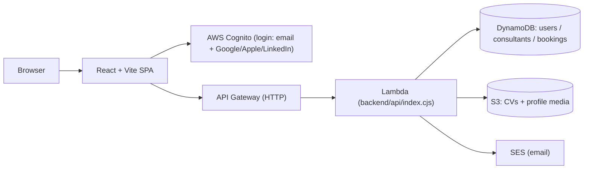

# GrowPoint

GrowPoint (**growpoint.bg**) is a career-mentoring marketplace. Two kinds of people use it:

- **Clients** — find an expert, browse profiles, book a session. Free.
- **Consultants / mentors** — publish a profile, manage a calendar, receive bookings. Paid (or invited).

This README is the short version. Deep history lives in git; the running QA log is in [`test.txt`](test.txt); contributor/agent notes are in [`CLAUDE.md`](CLAUDE.md); upcoming work is in [`plan.txt`](plan.txt).

---

## Architecture at a glance



- **Frontend:** a single-page React app. **Production `www.growpoint.bg` is served by GitHub Pages** from the committed repo root. An S3 + CloudFront test domain (`d30m6jtjij7col.cloudfront.net`) is ready for a future DNS cutover.
- **Backend:** one Lambda behind an HTTP API Gateway, with a Cognito JWT authorizer. Data in DynamoDB, files in S3, email via SES.
- **Infra:** all AWS resources are defined in Terraform (`infra/terraform/`).

---

## Repository layout

| Path | What's there |
|------|--------------|
| `src/app/legacy/SiteAppLegacy.tsx` | Most of the UI (home, profiles, dashboard, auth, booking) |
| `src/app/layout/AppShell.tsx` | Header, nav, footer, notification popovers |
| `src/app/pages/*` | Thin route wrappers (admin, notifications, messages, files…) |
| `src/lib/` | `api.ts` (API client), `auth.tsx`/`auth-flow.ts` (Cognito), `types.ts`, helpers |
| `src/styles/global.css` | All styling (light + dark theme) |
| `backend/api/index.cjs` | The entire backend Lambda (routes dispatched at the bottom) |
| `infra/terraform/` | Terraform for every AWS resource |
| `scripts/` | Build, smoke tests, data migrations, seeding |
| repo root (`index.html`, `assets/`, `consultants/`…) | The built site GitHub Pages serves |

---

## How it works (the short version)

- **Auth:** Cognito hosted UI handles email/password + Google/Apple/LinkedIn. On first authenticated call the app "bootstraps" a user record. Cognito group membership (`admin` / `consultants` / `clients`) is authoritative for role.
- **Data model:** three DynamoDB tables — `users` (key `userId` = Cognito sub), `consultants` (key `consultantId`; GSIs by slug / owner / status), `bookings` (key `bookingId`; GSIs by client / consultant).
- **Visibility:** a consultant is public when their account is **active** (`comped` via an admin invite, or a `granted`/`purchased` package) and the profile is complete enough. There is **no manual approval step**.
- **Uploads:** the browser uploads directly to S3 via short-lived pre-signed URLs from the Lambda.

---

## Business model

| | Price | Notes |
|---|---|---|
| Client account | **Free** | Browse + book |
| GrowPoint Start | 9.99 €/mo | Basic expert profile |
| GrowPoint Grow | 29.99 €/mo | "Препоръчан експерт" badge, more visibility |
| GrowPoint Spotlight | 99.99 €/mo | Premium placement + "★ GrowPoint суперзвезди" badge |

There are **no free mentor accounts**. Online payment (Stripe) **is not built yet** — pricing buttons show "Очаквай скоро". Until then, mentors join **by admin email invite** (free `comped` account); self-serve consultant signup is blocked with a notice. Admins can invite, restrict/suspend accounts, message users, grant packages, and feature profiles from `/admin`.

---

## Commands

```bash
npm run dev            # local dev server
npm run build          # gate: theme check + tsc + vite + route copies (writes the deployable site to repo root)
npm run smoke:prod     # 14 read-only production checks (expect 14/14)
bash scripts/check-secrets.sh   # secret scan
npm run deploy:cloudfront       # push the built site to the S3/CloudFront test domain
```

**Deploy production:** run the build + secret scan, commit, and push to `main` — GitHub Pages publishes `www`. Backend/infra changes go out via `terraform apply` (always review the plan first).

---

## Security & secrets

- This repo is **public**. Real secrets live **only** in `infra/terraform/terraform.tfvars`, which is gitignored. `README.md` and `test.txt` must stay secret-free.
- Every push runs CI (GitHub Actions): secret scan (incl. gitleaks) + build + `terraform validate`.
- Auth is enforced by the Cognito JWT authorizer; backend handlers call `requireAuth`/`requireAdmin`. No `innerHTML`/`dangerouslySetInnerHTML` anywhere. IAM is scoped to the three tables, the CV bucket, SES send, and read-only Cognito (+ enable/disable for restrict).

---

## Status (June 2026)

**Live & working:** the platform runs on `www.growpoint.bg`; social login (Google/Apple/LinkedIn); the paid Start/Grow/Spotlight model with badges; invite-only mentor onboarding; admin invite / restrict / message / package / feature; admin monitoring dashboard reading real Cognito + DynamoDB numbers; booking calendar, messages, notifications, files.

**Known gaps (see `plan.txt`):**
- **Stripe checkout** — needed to turn on self-serve paid signup (the one big missing piece).
- **SES production access** — the account is in sandbox, so platform email (invites, booking notices) only reaches *verified* addresses. DNS for `growpoint.bg` is in; production access must be requested in the AWS console.
- **`restricted` enforcement** — disabling Cognito blocks new logins; an already-issued token stays valid up to ~1h.
- Old `careerdoc-dev-*` tables/buckets are kept as a rollback backup — delete once the rename is confirmed stable.

### Recent changes (condensed)
- **2026-06-23:** referral links hardened and live-tested end to end: `?ref=CODE` signup, referred profile completion, +30 referrer reward, +20 referred profile reward, idempotency, and disposable cleanup all pass in production smoke.
- **2026-06-22:** points/rewards for clients (earn for profile completion, referrals, attended consultations, reviews; 100 points = a free consultation applied at booking) + a booking pay-gate (consultant adds a meeting link on approval; the client sees it only after payment — free-via-points releases it now, otherwise an admin manual "mark paid" bridge until Stripe).
- **2026-06:** rebrand `careerdoc → growpoint` (zero-downtime data migration); paid-mentor model + email invites + admin restrict/suspend (approval removed); Cognito-authoritative admin monitoring; header switched to the `logo.svg` wordmark (light + dark variants).

Full per-change history is in git and the QA log in [`test.txt`](test.txt).
