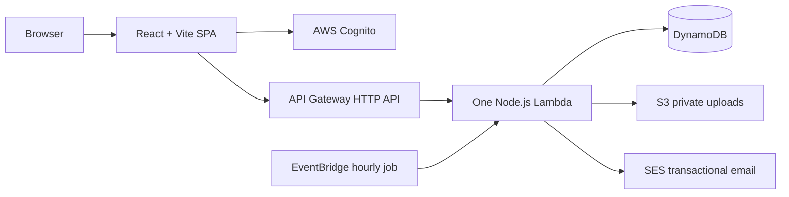

# GrowPoint

GrowPoint is a Bulgarian career-consulting marketplace. It helps clients discover consultants and mentors, request sessions, manage documents, and continue the conversation around a confirmed session.

The project is a React single-page app with a small serverless AWS backend. Its public interface is Bulgarian; the code and operational documentation are English.

## Product behaviour

- **Clients** create a free account, build a private profile, browse public expert profiles, request sessions, and manage bookings.
- **Consultants and mentors** manage a profile, availability, bookings, meeting links, and confirmed-session messages.
- **Admins** invite experts, manage visibility packages and featured status, restrict accounts, send admin messages, inspect platform metrics, and mark a booking paid until online payment is introduced.
- **Memberships:** Start (€9.99/month), Grow (€29.99/month), and Spotlight (€99.99/month) are the current expert tiers. Client accounts are free.
- **Onboarding:** expert self-service purchase is not implemented. The current expert path is an admin email invite, which grants a complimentary membership. A consultant becomes public only when membership is active and the profile satisfies the server-side visibility rules.
- **Bookings:** a client chooses an available slot; the consultant can accept, decline, reschedule, or cancel. Confirmed bookings support calendar downloads, session confirmation, reviews, in-app notifications, and email notifications when SES is configured.
- **Payments:** Stripe Checkout is not yet implemented. A booking is either unpaid, marked paid by an admin, or released through the client points reward. The meeting link remains hidden from the client while payment is unpaid.

## Architecture



The frontend uses Cognito for email/password authentication and optional hosted-UI social identity providers. API Gateway validates Cognito JWTs before protected requests reach the Lambda. The Lambda owns authorization, validation, data access, notification creation, signed S3 URLs, email sending, scheduled deletion, reminders, and demo-availability maintenance.

Public expert pages are cacheable briefly; media URLs are signed and short-lived. Documents remain private, download through signed URLs, and may be shared only with a consultant connected to a confirmed booking.

## Repository guide

| Path | Purpose |
| --- | --- |
| `src/app/legacy/SiteAppLegacy.tsx` | Main product UI: catalogue, expert profile, authentication, dashboard, booking, availability, points, and file flows. |
| `src/app/layout/AppShell.tsx` | Application shell, navigation, routing, theme, cookie consent, and header notifications. |
| `src/app/pages/` | Route-level wrappers and standalone pages such as admin, messages, legal, profile, and notifications. |
| `src/lib/` | API client, Cognito integration, types, SEO, uploads, dates, notifications, and URL helpers. |
| `src/styles/global.css` | Global light and dark theme styling. |
| `backend/api/index.cjs` | The complete Node.js Lambda handler and domain logic. |
| `infra/terraform/` | Cognito, API Gateway, Lambda, DynamoDB, S3, SES, CloudFront option, alarms, and EventBridge infrastructure. |
| `scripts/` | Build, deployment, secret scan, production smoke check, seed, migration, and maintenance scripts. |
| `public/` | Static assets copied into a build. |
| repository root `index.html`, `assets/`, and route folders | Generated GitHub Pages deployment output. |

## Data model and access boundaries

Three DynamoDB tables hold application state:

- `users`: Cognito-sub keyed private profiles, preferences, points, notification list, documents, referral state, invitations, and the visit counter.
- `consultants`: expert profiles, ownership, public slug, availability, membership/package state, visibility status, and aggregate review data.
- `bookings`: client/consultant relationship, slot, workflow state, payment state, messages, review, and meeting-link state.

The public catalogue exposes only visible consultant records and strips owner, booking, moderation, storage-key, and package-source fields. A member share link exposes a deliberately limited, unlisted profile card; it excludes email, documents, goals, plan, bookings, and other private fields. Admin authority comes from Cognito's `admin` group; the `consultants` and `clients` groups determine account roles at bootstrap.

Uploads are written directly to private S3 paths through short-lived pre-signed URLs. The Lambda validates path ownership and creates download URLs instead of exposing the bucket publicly. The browser should never receive AWS credentials.

## Local development

Prerequisites: Node.js 20+, npm, and (for infrastructure work) Terraform and configured AWS credentials.

```bash
npm ci
npm run dev
```

The app reads public browser configuration from Vite variables. Create a local ignored `.env.local` when needed:

```dotenv
VITE_APP_NAME=GrowPoint
VITE_AWS_REGION=eu-west-1
VITE_API_BASE_URL=https://your-api.example
VITE_COGNITO_USER_POOL_ID=your_pool_id
VITE_COGNITO_USER_POOL_CLIENT_ID=your_public_client_id
VITE_COGNITO_DOMAIN=your-hosted-ui-domain
VITE_COGNITO_SOCIAL_PROVIDERS=Google,Apple,LinkedIn
VITE_BASE_PATH=/
```

`VITE_*` values are compiled into the browser bundle and therefore are **not secrets**. Do not put passwords, AWS access keys, OAuth client secrets, Stripe secrets, private keys, or Terraform variables in any frontend environment file.

## Verification

```bash
npm run build                 # theme guard, TypeScript, Vite build, static routes
node --check backend/api/index.cjs
bash scripts/check-secrets.sh
npm run smoke:prod            # read-only production checks; requires configured access
```

`npm run build` regenerates the GitHub Pages files in the repository root. Review those generated changes deliberately when preparing a frontend deployment.

There is no unit-test runner yet. The production smoke script covers public availability, protected endpoints, CORS, and—when invoked with its explicit live-mutation option—the end-to-end application workflow using disposable records.

## Deployment and infrastructure

- The production web site is published by GitHub Pages from the committed repository-root build output. Build, scan for secrets, then push the intended commit to `main`.
- An optional private S3 + CloudFront SPA hosting stack is defined in Terraform for testing or a future DNS cutover.
- Backend and infrastructure changes are applied from `infra/terraform/`. Every new Lambda route must also have a matching `aws_apigatewayv2_route` resource.
- Terraform enables DynamoDB point-in-time recovery, private/encrypted storage, API throttling, Lambda error/throttle alarms, and an hourly EventBridge invocation for booking reminders, scheduled account deletion, and example-slot refresh.

Use this safe deployment order:

```bash
npm run build
bash scripts/check-secrets.sh
node --check backend/api/index.cjs
terraform -chdir=infra/terraform fmt -check -recursive
terraform -chdir=infra/terraform plan
```

Review the plan before applying it. Never approve a plan that destroys a DynamoDB table or replaces the Cognito user pool unless a deliberate, tested migration is in place.

## Security and privacy rules

- The repository is public. `infra/terraform/terraform.tfvars`, local environment files, state files, credentials, and private-key formats are ignored by Git.
- Keep public documentation, fixtures, generated frontend assets, and commit history free of credentials and personal data.
- API Gateway JWT authorization is necessary but not sufficient: Lambda handlers also enforce ownership, role, admin-group, visibility, and upload-path rules.
- `restricted` accounts are blocked from mutations even while a previously issued JWT remains valid.
- Use `createPortal(..., document.body)` for new modal or lightbox UI so overlays stay above the sticky shell.
- Every newly introduced colour must receive a dark-theme override; `npm run build` enforces this rule.

## Current limitations and roadmap

- Stripe checkout/webhooks are the main missing capability before self-service paid expert onboarding can be enabled.
- Transactional email needs a verified SES sender and, if the AWS account is still sandboxed, recipients must be verified.
- The large `SiteAppLegacy.tsx` and Lambda handler are intentional current consolidation points; code splitting and a dedicated automated-test layer are valuable next refactors.
- See [`plan.txt`](plan.txt) for the maintained implementation queue and [`docs/social-login-setup.md`](docs/social-login-setup.md) for social-login configuration.

## Contributing

Preserve existing uncommitted work, keep generated deployment output intentional, and do not commit secrets. For backend work, change the Lambda handler and matching Terraform route together. For visible UI work, verify both light and dark themes and test the route at desktop and mobile widths.
