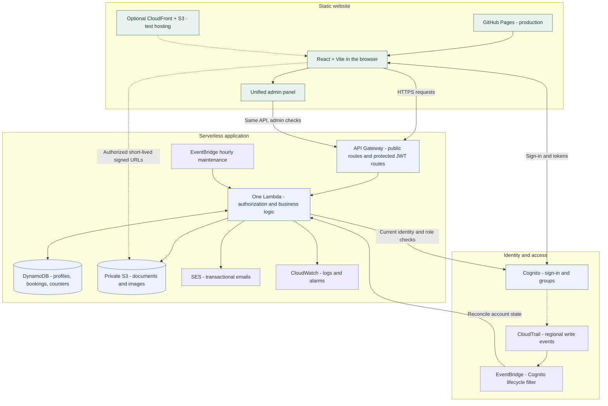

# GrowPoint

GrowPoint is a Bulgarian career-consulting marketplace. It helps clients discover consultants and mentors, request sessions, manage documents, and continue the conversation around a confirmed session.

The project is a React single-page app with a small serverless AWS backend. Its public interface is Bulgarian; the code and operational documentation are English.

## Product behaviour

- **Clients** create a free account, build a private profile, browse public expert profiles, request sessions, and manage bookings.
- **Consultants and mentors** manage a profile, availability, bookings, meeting links, and confirmed-session messages.
- **Admins** invite experts, manage visibility packages and featured status, restrict accounts, send admin messages, inspect platform metrics, and mark a booking paid until online payment is introduced.
- **Memberships:** Start (€9.99/month), Grow (€29.99/month), and Spotlight (€99.99/month) are the current expert tiers. Client accounts are free.
- **Onboarding:** expert self-service purchase is not implemented. The current expert path is an admin email invite, which grants a complimentary membership. A consultant becomes public only when membership is active and the profile satisfies the server-side visibility rules.
- **Bookings:** a client chooses an available slot; the consultant can accept, decline, reschedule, or cancel. Confirmed bookings support calendar downloads, session confirmation, reviews, in-app notifications, and email notifications when SES is configured.
- **Payments:** The bank-neutral card checkout is a clearly labelled preview only: it shows an order summary, accepted card schemes and a working preview action. Clicking “Pay” displays a mockup notice, never a successful payment. There is no card input, payment request, paid status, or package activation. A booking is either unpaid, marked paid by an admin, or released through the client points reward. The meeting link remains hidden from the client while payment is unpaid. Real DSK provider integration and verified webhooks remain future work.
- **Terms:** `/terms` includes the supplied V-POS clauses: Visa/Mastercard/bCard debit, credit and business cards; Identity Check/VISA Secure; a 4000 EUR maximum; no card-data storage; refunds to the same card. A notice explains that the live-payment clauses apply after activation. Confirm these conditions with the provider and legal reviewer before enabling payments; the preview does not implement a processor or refund service.

## Demonstration profile and homepage animation

The homepage and catalogue now render **API-backed expert profiles only**. The six static fictional profiles have been retired; their old `/examples/:id` links redirect to the catalogue. Empty results and API failures remain explicit rather than being replaced with mock cards.

An owner-supplied demonstration consultant has been filled through the normal profile forms, with an AI portrait, illustrative biography, and a conspicuous **Пример** label. It is a real application record, so it follows the same membership, visibility, booking, and statistics rules as other accounts; there is no hardcoded visibility bypass. It must have an active membership before it can appear publicly. Keep demonstration content labelled and never publish its login credentials. See [portrait provenance](docs/example-portraits.md) and the [latest QA report](docs/qa-2026-09-06.md).

The homepage uses a lightweight animated SVG: floating elements, a drawing growth curve, progress, and conversation dots. Animation pauses offscreen or in a hidden tab and respects reduced-motion preferences. The animation adds no AWS service or recurring compute job.

## Admin statistics

Open **`/admin`** while signed in with a Cognito **admin** account. Management and monitoring share this single panel; the old `/admin/dashboard` address redirects there. There is one statistics component and refresh loop, not duplicate sets of counters. There is no separate shared password. Both the page and API enforce admin access; the API checks current Cognito group membership.

The dashboard reports registrations, clients, consultants, mentors, profiles at 100%, public experts, booking/payment states, chat messages, reviews, documents, invitations, email outcomes, API errors, and 30-day activity charts.

Statistics use a shared, on-demand 15-minute snapshot with a refresh lock. Every statistics request rechecks Cognito, and changed identities invalidate the snapshot. The panel refreshes on focus. No statistics scan runs when nobody requests the dashboard. Email counters start when this version is deployed: **SES acceptance is not delivery**, and Cognito verification emails are not included. Visits mean browser sessions per day, not unique people. Historical chat totals may be incomplete before the cumulative counter was introduced. Unavailable/partial data is labelled, not fabricated.

## Cognito, DynamoDB, and website consistency

**Cognito is the identity authority; DynamoDB stores application state.** Cognito does not automatically delete DynamoDB records. This project supplies that connection:

1. A regional write-management CloudTrail trail captures events; EventBridge filters Cognito delete/disable/enable operations. EventBridge invokes the existing Lambda to reconcile the affected pool.
2. Cleanup removes private user data and uploads, releases future client booking slots, cancels future affected bookings, and retains non-public expert tombstones and anonymized booking history needed by the other participant. Point refunds are atomic. Failures remain retryable.
3. The existing hourly maintenance job runs a reconciliation at most once per day as a fallback. Missing entries in eventually consistent `ListUsers` are verified with `AdminGetUser` before cleanup; an inventory omission alone never authorizes deletion.
4. Every authenticated API request checks that its caller still exists and is enabled. This closes the gap where a valid JWT survives deletion/disablement. Admin requests also check current group membership.
5. Public identity checks cache for 60 seconds and public HTTP responses for 30 seconds. Visible catalogue/profile pages refresh each minute and on focus. Visible signed-in pages revalidate through notification polling.

This is **near-real-time, eventually consistent propagation—not an instantaneous guarantee**. CloudTrail/EventBridge can be delayed; the daily fallback repairs missed events. Private API checks operate independently of event delivery. Self-service deletion retains its seven-day grace period before final Cognito and application cleanup. Direct manual DynamoDB edits are not a supported account-management workflow.

## Keeping costs small

- No new always-on server, NAT gateway, provisioned Lambda concurrency, analytics service, or statistics database.
- DynamoDB remains on-demand; dashboard scans occur only on stale admin requests, with a shared snapshot and refresh lock.
- Public inventory uses `ListUsers`, avoiding bulk `AdminGetUser` calls that can count inactive users toward Cognito MAU billing. Authoritative private checks apply to users actually using the application.
- The trail logs regional write-management events, excluding KMS/RDS Data API; EventBridge filters four Cognito lifecycle operations. Trails cannot select management events by event name or Cognito event source. No read/data events, Insights, or CloudTrail Lake are enabled. Private audit objects expire after 30 days; write volume from other services also contributes to S3 usage.
- Terraform adds an account-wide $5 monthly warning budget: actual-spend warning at 20% (about $1), forecast warning at 100%. **A budget is not a hard spending cap.**

Low traffic should incur small usage-based costs, but **$0 is not guaranteed**: domain registration, storage, backups, alarms, requests, and free-tier eligibility still matter. Do not remove recovery or identity protections solely to chase zero cost. Review the AWS bill after deployment. See [Cognito cost tracking](https://docs.aws.amazon.com/cognito/latest/developerguide/tracking-cost.html) and [CloudTrail pricing](https://aws.amazon.com/cloudtrail/pricing/).

## Architecture



The frontend uses Cognito for email/password authentication and optional hosted-UI social identity providers. API Gateway validates Cognito JWTs before protected requests reach the Node.js 22 Lambda. The Lambda owns authorization, validation, data access, notification creation, signed S3 URLs, email sending, identity reconciliation, scheduled deletion, and reminders. Legacy mock seed/refresh jobs and the static example catalogue are removed; the owner-managed demonstration account uses the normal backend.

### How a session works

1. Browse a real public expert: active membership and server-side visibility rules determine eligibility.
2. Sign in, choose availability, and request a booking. Lambda validates identity, ownership, and slot state before persisting it.
3. The expert accepts or updates the request. The application records notifications and attempts transactional email through SES.
4. Confirmed bookings enable the relevant conversation and document-sharing permissions. The client meeting link remains locked until the supported payment/reward condition is satisfied.
5. Participants confirm completion and the client may review the session. Aggregate counters feed the same admin panel.

The card-checkout preview is deliberately outside this payment flow: opening it or clicking its payment action does not call a payment provider or unlock anything.

Public expert pages are cacheable briefly; media URLs are signed and short-lived. Documents remain private, download through signed URLs, and may be shared only with a consultant connected to a confirmed booking.

## Repository guide

| Path | Purpose |
| --- | --- |
| `src/app/legacy/SiteAppLegacy.tsx` | Main product UI: catalogue, expert profile, authentication, dashboard, booking, availability, points, and file flows. |
| `src/app/layout/AppShell.tsx` | Application shell, navigation, routing, theme, cookie consent, and header notifications. |
| `src/app/pages/` | Route-level wrappers and standalone pages such as admin, messages, legal, profile, and notifications. |
| `src/lib/` | API client, Cognito integration, types, SEO, uploads, dates, notifications, and URL helpers. |
| `src/styles/global.css` | Global light and dark theme styling. |
| `backend/api/index.cjs` | Lambda route dispatch and business logic. |
| `backend/api/identity.cjs`, `account-lifecycle.cjs` | Live identity validation and account cleanup. |
| `backend/api/monitoring.cjs`, `metrics-cache.cjs` | Aggregate counters and cached statistics. |
| `tests/` | Isolated Node regression tests with stubbed AWS clients. |
| `memory.md` | Maintained project context and release checklist. |
| `infra/terraform/` | Cognito, API Gateway, Lambda, DynamoDB, S3, SES, CloudFront option, alarms, and EventBridge infrastructure. |
| `scripts/` | Build, deployment, secret scan, production smoke check, seed, migration, and maintenance scripts. |
| `public/` | Static assets copied into a build. |
| repository root `index.html`, `assets/`, and route folders | Generated GitHub Pages deployment output. |

## Data model and access boundaries

Three DynamoDB tables hold application state:

- `users`: Cognito-sub keyed private profiles, preferences, points, notification list, documents, referral state, invitations, and the visit counter.
- `consultants`: expert profiles, ownership, public slug, availability, membership/package state, visibility status, and aggregate review data.
- `bookings`: client/consultant relationship, slot, workflow state, payment state, messages, review, and meeting-link state.

The public catalogue exposes only visible consultant records and strips owner, booking, moderation, storage-key, and package-source fields. A member share link exposes a deliberately limited, unlisted profile card; it excludes email, documents, goals, plan, bookings, and other private fields. Admin authority comes from Cognito's `admin` group; the `consultants` and `clients` groups determine account roles at bootstrap.

Uploads are written directly to private S3 paths through short-lived pre-signed URLs. The Lambda validates path ownership and creates download URLs instead of exposing the bucket publicly. The browser should never receive AWS credentials.

## Local development

Prerequisites: Node.js 22, npm, and (for infrastructure work) Terraform and configured AWS credentials.

```bash
npm ci
npm --prefix backend/api ci
npm run dev
```

The app reads public browser configuration from Vite variables. Create a local ignored `.env.local` when needed:

```dotenv
VITE_APP_NAME=GrowPoint
VITE_AWS_REGION=eu-west-1
VITE_API_BASE_URL=https://your-api.example
VITE_COGNITO_USER_POOL_ID=your_pool_id
VITE_COGNITO_USER_POOL_CLIENT_ID=your_public_client_id
VITE_COGNITO_DOMAIN=your-hosted-ui-domain
VITE_COGNITO_SOCIAL_PROVIDERS=Google,Apple,LinkedIn
VITE_BASE_PATH=/
```

`VITE_*` values are compiled into the browser bundle and therefore are **not secrets**. Do not put passwords, AWS access keys, OAuth client secrets, Stripe secrets, private keys, or Terraform variables in any frontend environment file.

## Verification

```bash
npm run build                 # theme guard, TypeScript, Vite build, static routes
npm test                      # isolated regression tests; no production mutations
node --check backend/api/index.cjs
bash scripts/check-secrets.sh
npm audit
npm --prefix backend/api audit
npm run smoke:prod            # read-only production checks; requires configured access
```

`npm run build` regenerates the GitHub Pages files in the repository root. Review those generated changes deliberately when preparing a frontend deployment.

Tests cover authorization, identity deletion/disablement, cleanup, pagination, private meeting links, telemetry, and statistics caching. The production smoke script covers public availability, protected endpoints, CORS, and—only when explicitly authorized and invoked with its live-mutation option—the application workflow using disposable records.

## Deployment and infrastructure

- The production web site is published by GitHub Pages from the committed repository-root build output. Build, scan for secrets, then push the intended commit to `main`.
- An optional private S3 + CloudFront SPA hosting stack is defined in Terraform for testing or a future DNS cutover.
- Backend and infrastructure changes are applied from `infra/terraform/`. Every new Lambda route must also have a matching `aws_apigatewayv2_route` resource.
- Terraform enables DynamoDB point-in-time recovery, private/encrypted storage, API throttling, Lambda error/throttle and HTTP 5xx alarms, hourly maintenance, Cognito lifecycle events, and cost alerts.

Use this safe deployment order:

```bash
npm run build
bash scripts/check-secrets.sh
node --check backend/api/index.cjs
terraform -chdir=infra/terraform fmt -check -recursive
terraform -chdir=infra/terraform validate
terraform -chdir=infra/terraform plan
```

Run `terraform -chdir=infra/terraform init -upgrade` when adopting the provider lock update (AWS 6.63). This version supports the pool friendly-name change in place; its ID and accounts remain unchanged. Review the plan before applying it. Never approve a plan that destroys a DynamoDB table or replaces the Cognito user pool unless a deliberate, tested migration is in place.

## Security and privacy rules

- The repository is public. `infra/terraform/terraform.tfvars`, local environment files, state files, credentials, and private-key formats are ignored by Git.
- Keep public documentation, fixtures, generated frontend assets, and commit history free of credentials and personal data.
- API Gateway JWT authorization is necessary but not sufficient: Lambda handlers also enforce ownership, role, admin-group, visibility, and upload-path rules.
- `restricted` accounts are blocked from mutations even while a previously issued JWT remains valid.
- Use `createPortal(..., document.body)` for new modal or lightbox UI so overlays stay above the sticky shell.
- Every newly introduced colour must receive a dark-theme override; `npm run build` enforces this rule.

## Current limitations and roadmap

### QA snapshot — 6 September 2026

**Expert visibility:** admins can choose **Automatic at 100%**, **Shown**, or **Hidden** on each expert card. Saving a complete profile or granting any tier (including Start) publishes an active member into the catalogue. Explicit hiding survives later edits. Showing cannot bypass inactive membership, suspension, deletion, or a disabled/missing Cognito account. Portrait/cover images are optional; provided image URLs must still be valid. Existing complete hidden profiles can be shown from admin after deployment; no bulk publication was performed. Deploy the new authenticated `/admin/consultants/{consultantId}/visibility` route and Lambda before publishing the frontend.

**Release status: not yet production-certified.** The latest read-only checks confirm SES sandbox mode and an empty public expert catalogue. Automatic role reconciliation remains open, and booking/chat/shared-file workflows still require live end-to-end verification. Passing isolated tests is not a launch approval. Card payments remain intentionally mocked.

Run `npm run smoke:prod -- --require-public-profile` to fail the read-only smoke check when no public expert is available. The normal command now reports that check as skipped, not passed.

Local results describe the prepared code, not a deployed release. Browser fixtures are isolated test data, not production accounts. See the [QA report](docs/qa-2026-09-06.md) for scope and evidence.

| Area tested | Result | Remaining issue / scope |
| --- | --- | --- |
| Automated regression checks | 40 tests passed locally | Includes ownership, identity cleanup, metrics, visibility and UI-policy checks; not full end-to-end certification. |
| Production smoke | 13 executed checks pass; 1 skipped | Empty catalogue prevents individual expert-profile verification; strict mode fails. |
| Sign-in, profile saves, own-file upload/download/delete | Passed with supplied QA accounts in the earlier live pass | No destructive identity deletion test on those persistent accounts. |
| Mobile links, header names, portrait keyboard controls | Fixed and browser-tested locally | Requires frontend publication. |
| Shared visual polish | 20 local page/viewport checks without overflow or JavaScript exceptions; light/dark screenshots inspected | Reduced-motion button transitions verified off; no new dependencies or infrastructure. |
| Expert completion and admin calculation | Local tests agree; complete editable expert form reaches 100% | Requires frontend **and backend** deployment; no membership or visibility bypass. |
| Card checkout and terms | Mockup action, return flow, focus handling and six clauses checked | No card collection or payment requests; real processor and refunds are not implemented. |
| Bootstrap profile preservation | Regression passed locally | Saved name/portrait preserved; automatic Cognito role reconciliation remains unresolved. |
| Booking, two-party chat, shared-file permissions | Not verified end to end | Requires an active test expert; isolated access-denial checks passed. |
| Email and full release readiness | Not certified | SES was sandboxed at the last live check; delivery and disposable-account lifecycle tests remain release gates. |

- DKS provider integration and verified, idempotent webhooks are required before self-service paid onboarding can be enabled. The current preview never changes payment state.
- Transactional email needs a verified SES sender and, if the AWS account is still sandboxed, recipients must be verified.
- The large `SiteAppLegacy.tsx` and Lambda handler remain consolidation points; regression tests and lazy admin chunks are now present.
- See [`plan.txt`](plan.txt) for the maintained implementation queue and [`docs/social-login-setup.md`](docs/social-login-setup.md) for social-login configuration.

## Contributing

The shared interface uses a native system-font stack, sage-accent primary actions, consistent rounded controls, segmented tabs, restrained surface shadows and a translucent header. Styling lives in the final interaction-polish section of `src/styles/global.css`. Preserve light/dark token pairs, visible keyboard focus, destructive-action colour, disabled states and reduced-motion support. No additional UI library or hosted service is required.

Preserve existing uncommitted work, keep generated deployment output intentional, and do not commit secrets. For backend work, change the Lambda handler and matching Terraform route together. For visible UI work, verify both light and dark themes and test the route at desktop and mobile widths.

## Deployment acceptance checks

Apply reviewed backend infrastructure before publishing the rebuilt frontend. Local tests and read-only smoke checks do not replace deployed, authenticated end-to-end checks:

- Verify SES production access, sender verification, sending status, and delivery to an unverified recipient. Sandbox acceptance does not prove general email readiness.
- Verify dashboard counts as an admin and confirm a non-admin cannot access its API.
- With an explicitly disposable account, test Cognito disable/enable/deletion, event delivery, DynamoDB cleanup, public disappearance, and old-session rejection. Confirm the daily fallback and alarms operate.
- Exercise bookings, chat, uploads, invitations, cancellation, and points after deployment.
- Keep DKS labelled as a preview until the real integration is implemented and tested.

Do not label the release fully production-verified until these checks pass. Never commit Terraform plans, state, deployment archives, credentials, or personal data.
