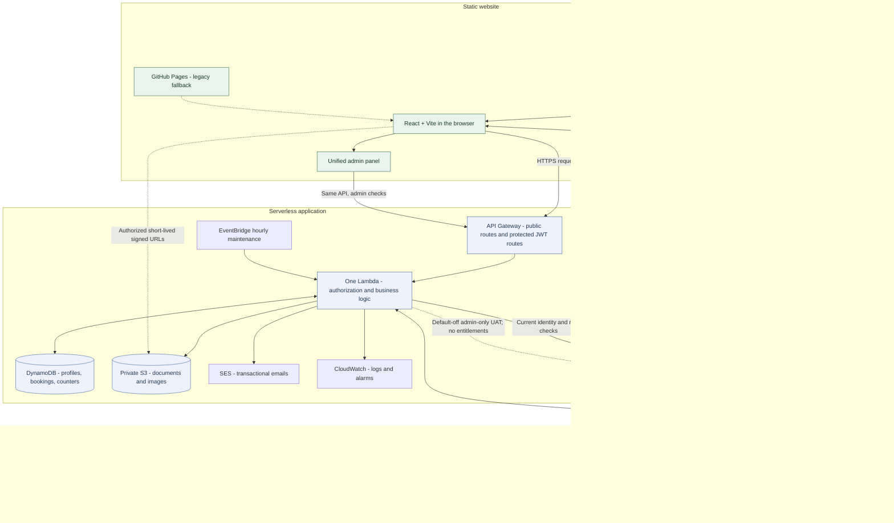

# GrowPoint

GrowPoint is a Bulgarian career-consulting marketplace. It helps clients discover consultants and mentors, request sessions, manage documents, and continue the conversation around a confirmed session.

The project is a React single-page app with a small serverless AWS backend. Its public interface is Bulgarian; the code and operational documentation are English.

## Product behaviour

- **Clients** create a free account, build a private profile, browse public expert profiles, request sessions, and manage bookings.
- **Consultants and mentors** manage a profile, availability, bookings, meeting links, and confirmed-session messages.
- **Admins** invite experts, manage visibility packages and featured status, restrict accounts, send admin messages, inspect platform metrics, and mark a booking paid until online payment is introduced.
- **Memberships:** Start (€9.99/month), Grow (€29.99/month), and Spotlight (€99.99/month) are the current expert tiers. Client accounts are free.
- **Tier benefits:** every active expert offers one free client session per scheduled calendar month (Europe/Sofia), claimed atomically by the first client who chooses it. Cancel/decline before the start releases it; a started session consumes it. Points are separate. Grow/Spotlight have catalogue/homepage priority; Spotlight also has a personal homepage banner, profile colors and tracked podcast/campaign/quarterly-room requests. Admins schedule and record fulfillment; requests do not guarantee an unconfirmed venue or date. All benefits reuse existing tables and on-demand requests, without a new recurring service.
- **Onboarding:** expert self-service purchase is not implemented. The current expert path is an admin email invite, which grants a complimentary membership. A consultant becomes public only when membership is active and the profile satisfies the server-side visibility rules.
- **Bookings:** a client chooses an available slot; the consultant can accept, decline, reschedule, or cancel. Confirmed bookings support calendar downloads, session confirmation, reviews, in-app notifications, and email notifications when SES is configured.
- **Payments:** Public checkout remains a clearly labelled, bank-neutral preview: no card input, charging request or package activation. A booking is unpaid, admin-marked paid, or free through points/the expert's monthly offer; unpaid meeting links stay hidden. The isolated, default-off admin DSK sandbox passed five EUR 1 fake-card website-to-bank-and-return cases with independent bank verification. Earlier portal-only cases are separate evidence. No real funds or production entitlements changed. Sandbox is verified disabled with empty deployed credentials and no Terraform drift; production billing and bank approval remain outstanding. See the [DSK results](docs/dsk-sandbox-results-2026-10-01.md).
- **Terms:** `/terms` includes the supplied V-POS clauses: Visa/Mastercard/bCard debit, credit and business cards; Identity Check/VISA Secure; a 4000 EUR maximum; no card-data storage; refunds to the same card. A notice explains that the live-payment clauses apply after activation. Confirm these conditions with the provider and legal reviewer before enabling payments; the preview does not implement a processor or refund service.

## Finding the next step

The homepage starts with one main action: explore the experts. Six short topic links, a three-step booking guide and native expandable answers explain the journey without requiring registration or promising a confirmed booking. Expert joining leads to contacts while onboarding remains invite-only.

The directory matches selected topics against profile keywords, excludes unrelated profiles, labels ratings as **4.5+** only when reviews exist, and shows a result count with a clear way to reset an empty search. Topic matching is a keyword aid, not a qualification assessment or a guarantee of suitability. Paid-tier positioning remains visible and applies within the selected filters; matching badges use words, not unexplained percentage claims.

Search text and city stay as drafts until **Търси** or Enter is pressed, avoiding catalogue requests for every keystroke. These improvements reuse existing routes, profile data and theme tokens; they add no dependency, cloud service or recurring job. Engagement or conversion improvement has **not** been measured. See the [8 October UX/QA report](docs/qa-2026-10-08.md).

## Demonstration profile and homepage animation

The homepage and catalogue now render **API-backed expert profiles only**. The six static fictional profiles have been retired; their old `/examples/:id` links redirect to the catalogue. Empty results and API failures remain explicit rather than being replaced with mock cards.

An owner-supplied demonstration consultant has been filled through the normal profile forms, with an AI portrait, illustrative biography, and a conspicuous **Пример** label. It is a real application record, so it follows the same membership, visibility, booking, and statistics rules as other accounts; there is no hardcoded visibility bypass. It must have an active membership before it can appear publicly. Keep demonstration content labelled and never publish its login credentials. See [portrait provenance](docs/example-portraits.md), the [latest UX/QA report](docs/qa-2026-10-08.md) and the [3 October lifecycle QA](docs/qa-2026-10-03.md).

Spotlight homepage banners show the existing profile portrait even without a cover image, plus up to three actual expertise topics and a profile link. Optional covers remain supported; failed images fall back gracefully without hiding the profile or its example disclosure. The layout stacks on mobile and supports both themes. No new media service or demonstration account is created.

The homepage uses a lightweight animated SVG: floating elements, a drawing growth curve, progress, and conversation dots. Animation pauses offscreen or in a hidden tab and respects reduced-motion preferences. The animation adds no AWS service or recurring compute job.

## Admin statistics

Open **`/admin`** while signed in with a Cognito **admin** account. Management and monitoring share this single panel; the old `/admin/dashboard` address redirects there. There is one statistics component and refresh loop, not duplicate sets of counters. There is no separate shared password. Both the page and API enforce admin access; the API checks current Cognito group membership.

The dashboard reports registrations, clients, consultants, mentors, profiles at 100%, public experts, booking/payment states, chat messages, reviews, documents, invitations, email outcomes, API errors, and 30-day activity charts.

Statistics use a shared, on-demand 15-minute snapshot with a refresh lock. Every statistics request rechecks Cognito, and changed identities invalidate the snapshot. The panel refreshes on focus. No statistics scan runs when nobody requests the dashboard. Email counters start when this version is deployed: **SES acceptance is not delivery**, and Cognito verification emails are not included. Visits mean browser sessions per day, not unique people. Historical chat totals may be incomplete before the cumulative counter was introduced. Unavailable/partial data is labelled, not fabricated.

## Cognito, DynamoDB, and website consistency

**Cognito is the identity authority; DynamoDB stores application state.** Cognito does not automatically delete DynamoDB records. This project supplies that connection:

1. A regional write-management CloudTrail trail captures events; EventBridge filters Cognito delete/disable/enable operations. EventBridge invokes the existing Lambda to reconcile the affected pool.
2. Cleanup removes private user data and uploads, releases future client booking slots, cancels future affected bookings, and retains non-public expert tombstones and anonymized booking history needed by the other participant. Point refunds are atomic. Failures remain retryable.
3. The existing hourly maintenance job runs a reconciliation at most once per day as a fallback. Missing entries in eventually consistent `ListUsers` are verified with `AdminGetUser` before cleanup; an inventory omission alone never authorizes deletion.
4. Every authenticated API request checks that its caller still exists and is enabled. This closes the gap where a valid JWT survives deletion/disablement. Admin requests also check current group membership.
5. Public identity checks cache for 60 seconds and public HTTP responses for 30 seconds. Visible catalogue/profile pages refresh each minute and on focus. Visible signed-in pages revalidate through notification polling.

This is **near-real-time, eventually consistent propagation—not an instantaneous guarantee**. CloudTrail/EventBridge can be delayed; the daily fallback repairs missed events. Private API checks operate independently of event delivery. Self-service deletion retains its seven-day grace period before final Cognito and application cleanup. Direct manual DynamoDB edits are not a supported account-management workflow.

## Keeping costs small

- No new always-on server, NAT gateway, provisioned Lambda concurrency, analytics service, or statistics database.
- DynamoDB remains on-demand; dashboard scans occur only on stale admin requests, with a shared snapshot and refresh lock.
- Public inventory uses `ListUsers`, avoiding bulk `AdminGetUser` calls that can count inactive users toward Cognito MAU billing. Authoritative private checks apply to users actually using the application.
- The trail logs regional write-management events, excluding KMS/RDS Data API; EventBridge filters four Cognito lifecycle operations. Trails cannot select management events by event name or Cognito event source. No read/data events, Insights, or CloudTrail Lake are enabled. Private audit objects expire after 30 days; write volume from other services also contributes to S3 usage.
- Terraform adds an account-wide $5 monthly warning budget: actual-spend warning at 20% (about $1), forecast warning at 100%. **A budget is not a hard spending cap.**

Low traffic should incur small usage-based costs, but **$0 is not guaranteed**: domain registration, storage, backups, alarms, requests, and free-tier eligibility still matter. Do not remove recovery or identity protections solely to chase zero cost. Review the AWS bill after deployment. See [Cognito cost tracking](https://docs.aws.amazon.com/cognito/latest/developerguide/tracking-cost.html) and [CloudTrail pricing](https://aws.amazon.com/cloudtrail/pricing/).

## Architecture


```mermaid
flowchart TB
  subgraph Web[Static website]
    GH[GitHub - source and CI] -.->|Reviewed manual deployment| CF[CloudFront + private S3 - production]
    CF --> SPA[React + Vite in the browser]
    LEGACY[GitHub Pages - legacy fallback] -.-> SPA
    SPA --> ADMIN[Unified admin panel]
  end
  subgraph Identity[Identity and access]
    C[Cognito - sign-in and groups]
    CT[CloudTrail - regional write events]
    EV[EventBridge - Cognito lifecycle filter]
    C -.-> CT --> EV
  end
  subgraph Backend[Serverless application]
    API[API Gateway - public routes and protected JWT routes]
    L[One Lambda - authorization and business logic]
    D[(DynamoDB - profiles, bookings, counters)]
    S[(Private S3 - documents and images)]
    E[SES - transactional emails]
    JOB[EventBridge hourly maintenance]
    CW[CloudWatch - logs and alarms]
    API --> L
    L <--> D
    L --> S
    L --> E
    L --> CW
    JOB --> L
  end
  SPA <-->|Sign-in and tokens| C
  SPA -->|HTTPS requests| API
  ADMIN -->|Same API, admin checks| API
  L -->|Current identity and role checks| C
  EV -->|Reconcile account state| L
  SPA -.->|Authorized short-lived signed URLs| S
  L -.->|Default-off admin-only UAT; no entitlements| BANK[DSK sandbox - hosted card entry]
  classDef static fill:#eaf4ee,stroke:#387052,color:#173926
  classDef secure fill:#edf2fc,stroke:#496ca8,color:#233751
  class SPA,GH,CF,LEGACY,ADMIN static
  class C,API,L,D,S secure
```

The frontend uses Cognito for email/password authentication and optional hosted-UI social identity providers. API Gateway validates Cognito JWTs before protected requests reach the Node.js 22 Lambda. The Lambda owns authorization, validation, data access, notification creation, signed S3 URLs, email sending, identity reconciliation, scheduled deletion, and reminders. Legacy mock seed/refresh jobs and the static example catalogue are removed; the owner-managed demonstration account uses the normal backend.

### How a session works

1. Browse a real public expert: active membership and server-side visibility rules determine eligibility.
2. Sign in, choose availability, and request a booking. Lambda validates identity, ownership, and slot state before persisting it.
3. The expert accepts or updates the request. The application records notifications and attempts transactional email through SES.
4. Confirmed bookings enable the relevant conversation and document-sharing permissions. The client meeting link remains locked until the supported payment/reward condition is satisfied.
5. Participants confirm completion and the client may review the session. Aggregate counters feed the same admin panel.

The card-checkout preview is deliberately outside this payment flow: opening it or clicking its payment action does not call a payment provider or unlock anything.

Public expert pages are cacheable briefly; media URLs are signed and short-lived. Documents remain private, download through signed URLs, and may be shared only with a consultant connected to a confirmed booking.

## Repository guide

| Path | Purpose |
| --- | --- |
| `src/app/legacy/SiteAppLegacy.tsx` | Main product UI: catalogue, expert profile, authentication, dashboard, booking, availability, points, and file flows. |
| `src/app/layout/AppShell.tsx` | Application shell, navigation, routing, theme, cookie consent, and header notifications. |
| `src/app/pages/` | Route-level wrappers and standalone pages such as admin, messages, legal, profile, and notifications. |
| `src/app/components/HomeDiscovery.tsx`, `HomeDiscovery.css` | Compact homepage topic links, booking guide and native FAQs, using existing routes and light/dark tokens. |
| `src/lib/` | API client, Cognito integration, types, SEO, uploads, dates, notifications, and URL helpers. |
| `src/styles/global.css` | Global light and dark theme styling. |
| `backend/api/index.cjs` | Lambda route dispatch and business logic. |
| `backend/api/identity.cjs`, `account-lifecycle.cjs` | Live identity validation and account cleanup. |
| `backend/api/monitoring.cjs`, `metrics-cache.cjs` | Aggregate counters and cached statistics. |
| `tests/` | Isolated Node regression tests with stubbed AWS clients. |
| `memory.md` | Maintained project context and release checklist. |
| `infra/terraform/` | Cognito, API Gateway, Lambda, DynamoDB, S3, SES, production CloudFront, alarms, and EventBridge infrastructure. |
| `scripts/` | Build, deployment, secret scan, production smoke check, seed, migration, and maintenance scripts. |
| `public/` | Static assets copied into a build. |
| repository root `index.html`, `assets/`, and route folders | Generated legacy GitHub Pages output; owner creatives remain in `assets/advertisement/`. |
| `dist/` | Ignored production CloudFront build, generated by `npm run build:cloudfront`. |

## Data model and access boundaries

Three DynamoDB tables hold application state:

- `users`: Cognito-sub keyed private profiles, preferences, points, notification list, documents, referral state, invitations, and the visit counter.
- `consultants`: expert profiles, ownership, public slug, availability, membership/package state, visibility status, and aggregate review data.
- `bookings`: client/consultant relationship, slot, workflow state, payment state, messages, review, and meeting-link state.

The public catalogue exposes only visible consultant records and strips owner, booking, moderation, storage-key, and package-source fields. A member share link exposes a deliberately limited, unlisted profile card; it excludes email, documents, goals, plan, bookings, and other private fields. Admin authority comes from Cognito's `admin` group; the `consultants` and `clients` groups determine account roles at bootstrap.

Uploads are written directly to private S3 paths through short-lived pre-signed URLs. The Lambda validates path ownership and creates download URLs instead of exposing the bucket publicly. The browser should never receive AWS credentials.

## Local development

Prerequisites: Node.js 22, npm, and (for infrastructure work) Terraform and configured AWS credentials.

```bash
npm ci
npm --prefix backend/api ci
npm run dev
```

The app reads public browser configuration from Vite variables. Create a local ignored `.env.local` when needed:

```dotenv
VITE_APP_NAME=GrowPoint
VITE_AWS_REGION=eu-west-1
VITE_API_BASE_URL=https://your-api.example
VITE_COGNITO_USER_POOL_ID=your_pool_id
VITE_COGNITO_USER_POOL_CLIENT_ID=your_public_client_id
VITE_COGNITO_DOMAIN=your-hosted-ui-domain
VITE_COGNITO_SOCIAL_PROVIDERS=Google,Apple,LinkedIn
VITE_BASE_PATH=/
```

`VITE_*` values are compiled into the browser bundle and therefore are **not secrets**. Do not put passwords, AWS access keys, OAuth client secrets, Stripe secrets, private keys, or Terraform variables in any frontend environment file.

## Verification

```bash
npm run build                 # theme guard, TypeScript, Vite build, static routes
npm run build:cloudfront      # same checks; production files in dist/
npm test                      # isolated regression tests; no production mutations
node --check backend/api/index.cjs
bash scripts/check-secrets.sh
npm audit
npm --prefix backend/api audit
npm run smoke:prod            # read-only production checks; requires configured access
```

`npm run build` regenerates the legacy GitHub Pages files in the repository root. `npm run build:cloudfront` writes the production build to `dist/`. Neither command publishes the website; review generated changes before committing.

Tests cover authorization, identity deletion/disablement, cleanup, pagination, private meeting links, telemetry, and statistics caching. Production smoke is read-only. The old `--live-mutate` workflow is retired because it fabricated paid states/attendance and manually repaired data, so it could not prove production workflows.

`npm run qa:identity` performs **no requests or changes** by default. After explicit owner approval, `npm run qa:identity -- --live-identity --allow-disposable` tests one suppressed-mail disposable client against the current Terraform target: login/bootstrap persistence, disable/enable, old-session rejection, deletion and automatic DynamoDB/referral cleanup. It never repairs application rows to manufacture a pass. Bounded event timeouts are inconclusive, not successful; this narrow check does not certify S3/files, expert-booking cleanup or recipient email delivery.

## Deployment and infrastructure

- **`growpoint.bg` and `www.growpoint.bg` use CloudFront with a private S3 origin.** Apex redirects to canonical HTTPS www. GitHub stores source, runs CI, and retains the legacy Pages build. **A Git push does not publish CloudFront.**
- `npm run deploy:cloudfront` builds `dist/`, publishes assets before HTML, keeps previous hashed chunks for open tabs, and invalidates all routes with one wildcard. Only hashed JavaScript/CSS receive one-year immutable caching; stable assets revalidate after 300 seconds. Existing owner creatives are copied into the CloudFront build without changing their source files.
- Both DNS routes and validation records are published, the managed certificate is issued for apex and www, and the distribution is deployed. **The complete domain gate passes 4/4:** both hosts have valid TLS and secure HTTP redirects. The authorized apex cutover preserved existing mail and certificate-validation records. The canonical redirect preserves encoded invite/referral/OAuth parameters.
- Backend and infrastructure changes are applied from `infra/terraform/`. Every new Lambda route must also have a matching `aws_apigatewayv2_route` resource.
- Terraform enables DynamoDB point-in-time recovery, private/encrypted storage, API throttling, Lambda error/throttle and HTTP 5xx alarms, hourly maintenance, Cognito lifecycle events, and cost alerts.

Use this safe deployment order:

```bash
npm run build
npm test
bash scripts/check-secrets.sh
node --check backend/api/index.cjs
terraform -chdir=infra/terraform fmt -check -recursive
terraform -chdir=infra/terraform validate
terraform -chdir=infra/terraform plan
```

Run `terraform -chdir=infra/terraform init -upgrade` when adopting the provider lock update (AWS 6.63). This version supports the pool friendly-name change in place; its ID and accounts remain unchanged. Review the plan before applying it. Never approve a plan that destroys a DynamoDB table or replaces the Cognito user pool unless a deliberate, tested migration is in place.

After any authorized backend apply, commit and push the intended release, then run `npm run deploy:cloudfront`. Wait for the CloudFront invalidation to complete and verify live www HTML, referenced JavaScript/CSS, media MIME types, direct SPA routes, and authentication. CI validates changes but does not upload production files. Verify release bytes after each deployment; a successful push or invalidation request alone is not deployment proof.

## Security and privacy rules

- The repository is public. `infra/terraform/terraform.tfvars`, local environment files, state files, credentials, and private-key formats are ignored by Git.
- Sandbox settings also stay in ignored owner-only files. The secret gate rejects force-added `.tfvars`, state/backups and saved plans; sandbox credentials are absent from the deployed Lambda while testing is disabled.
- Keep public documentation, fixtures, generated frontend assets, and commit history free of credentials and personal data.
- API Gateway JWT authorization is necessary but not sufficient: Lambda handlers also enforce ownership, role, admin-group, visibility, and upload-path rules.
- `restricted` accounts are blocked from mutations even while a previously issued JWT remains valid.
- Use `createPortal(..., document.body)` for new modal or lightbox UI so overlays stay above the sticky shell.
- Every newly introduced colour must receive a dark-theme override; `npm run build` enforces this rule.

## Current limitations and roadmap

### QA snapshot — through 8 October 2026

**Expert visibility:** admins can choose **Automatic at 100%**, **Shown**, or **Hidden** on each expert card. Saving a complete profile or granting any tier (including Start) publishes an active member into the catalogue. Explicit hiding survives later edits. Showing cannot bypass inactive membership, suspension, deletion, or a disabled/missing Cognito account. Portrait/cover images are optional; provided image URLs must still be valid. The authenticated visibility route is deployed; no bulk publication was performed.

**Launch is not yet certified.** The 8 October work improves public discovery and copy; it does not close the remaining launch gates. The 3 October disposable-client lifecycle passed 8/8 live checks; a separate genuine client also passed scheduled-deletion/cancellation, signed PDF upload/download and automatic Cognito/DynamoDB/S3 cleanup. That release's deployed smoke and domain checks passed. Natural seven-day expiry and expert-booking cleanup remain untested live. The last SES audit found denied/sandboxed access; real inbox signup and complete social callbacks are unverified, and legal/operator approval remains outstanding. The 1 October payment/security baseline is unchanged: five website sandbox card cases passed and all four supplied QA accounts were rotated with old sessions rejected. That release disabled sandbox access and cleared deployed credentials. SNS email-subscription drift still awaits owner authorization; no zero-drift claim. History cleanup also requires separate approval. See the [latest UX/QA report](docs/qa-2026-10-08.md), [lifecycle QA](docs/qa-2026-10-03.md) and [security audit](docs/public-repo-security-audit-2026-10-01.md).

Run `npm run smoke:prod -- --require-public-profile` to fail the read-only smoke check when no public expert is available. The normal command now reports that check as skipped, not passed.

Live checks use owner-supplied QA accounts and explicitly authorized disposable identities only. Automated and intercepted-browser fixtures are separate evidence, not proof of actual email or completed social-provider callbacks. The disposable client uses suppressed creation mail, so its successful lifecycle does not prove inbox signup.

| Area tested | Result | Remaining issue / scope |
| --- | --- | --- |
| Portrait-first Spotlight banner — 8 October follow-up | **277/277 local regressions passed**, no skips; build/theme/TypeScript and secret guard pass. Local 320/390/768/1440px light/dark checks fit, portrait loads and CTA is ≥44px. Fresh native-origin 390/1440px light/dark checks and keyboard profile navigation pass | Source `baa993c7` pushed, CI/legacy Pages successful and CloudFront invalidation complete. HTML, all six built JS/CSS chunks and four owner media files match production bytes; smoke 19/19 www, 20/20 CloudFront and domains 4/4. Failure/recovery fixtures are local; no account or launch-gate changes. |
| Public discovery and copy — 8 October | **271/271 local regressions passed**, no skips; final build/theme/TypeScript, public secret guard and diff checks pass. Local home/directory checks at 320/360/390/768/1440px in both themes fit; new targets ≥44px. Live native-origin topic links, search/back/reset, guide/FAQs and public-profile navigation pass without runtime errors | Source `a5ea28bd` pushed with passing CI/legacy Pages and deployed to CloudFront. Live home 390/1440px light/dark and mobile dark directory fit. Proxy/empty/503 fixtures are separate evidence; no engagement uplift or new authenticated/payment/launch-gate proof. |
| Backend/lifecycle release — 3 October | **265/265 passed locally**, no skips; backend syntax and Terraform format/validation passed alongside that release's build checks | Source `33715795` pushed, CI/Pages passed and frontend deployed. Backend Active/Successful, archive hash matched; anonymous cancellation 401. Disposable client cancellation/file cleanup passed live within the scope below. |
| Public repository security | Historical QA credential exposure confirmed; all four supplied accounts rotated and old sessions rejected | Current public files/build checks pass. History cleanup remains separately approval-gated; scanner success cannot erase old copies. |
| Existing public profile and read-only smoke | Fresh **19/19 passed** on www after the 8 October deployment | Referenced JS/CSS/media checks reject missing-asset SPA HTML; read-only smoke is not authenticated workflow certification. |
| CloudFront deployment | Fresh **20/20 passed**; 8 October deployment/invalidation complete. Canonical HTML and all seven referenced entry/vendor/CSS/admin chunks match the reviewed build; four owner media files pass MIME and complete-file byte checks | Both hosts route to CloudFront; apex redirects to canonical HTTPS www. This is frontend/public release proof, not private workflow certification. |
| Domain TLS and HTTP redirects | Fresh **4/4 passed** after the 8 October deployment | Recheck after release. Existing mail and ACM validation records were preserved during the authorized DNS cutover; no DNS change in this UI pass. |
| Mobile availability / booking and package UI | Isolated 320/360/390/430/1440px light/dark checks pass: 44px targets, draft preservation/retry, occupied-slot protection, contained calendar and benefit controls | Browser fixtures are not device or live-save proof. Existing public-profile navigation and HTTPS smoke pass live. |
| Expert tier benefits | Quota concurrency, cancellations, cross-month rescheduling, review rewards, tier ranking/colors/banner and Spotlight request workflow pass regressions/fixtures | No persistent-account membership/booking/fulfillment states were manufactured; live paid billing and benefit fulfillment are not certified. |
| Supplied-account booking/chat/files | Live acceptance, two-way automatic chat, rescheduling, cancellation, sharing/download and revocation passed | New QA booking cancelled/unpaid; new QA files removed. Archived chat reads work; sends return 400. Issued document links expire within 15 minutes. |
| Permissions and notifications | All four supplied accounts: profile/bookings/notifications 200; non-admin sandbox access 403; anonymous sandbox access 401 | Single-notification read and unrelated-user denial passed earlier. Destructive lifecycle/admin mutations on persistent accounts are not used as tests. |
| Admin statistics | Live 200, unified panel and mobile layout checked | Cognito registrations and initialized application profiles are different, labelled populations. |
| Disposable Cognito client lifecycle | **8/8 passed live**; a separate file-bearing disposable client also passed external-delete cleanup | Old token 401, user/referral rows removed and both owned S3 prefixes empty, including registered PDF/orphan upload; no manual cleanup. Expert bookings and natural seven-day expiry remain untested live. |
| Scheduled deletion/cancellation and files | **Passed live**: explicit current agreement/bootstrap, signed PDF upload/download with matching bytes/MIME, repeated schedule/cancel idempotence and mobile UI cancellation | Recorded business fields preserved; pending public profile 404/edit 403, private profile/export 200. Actual 390/1440px light/dark panels fit. Deleted-session reload returns to sign-in with tokens absent. Expert restoration is regression-only; persistent accounts preserved. |
| Signup, social repair, export and dialog errors | Existing fixes have regressions/fixtures; genuine Google, Apple and LinkedIn sign-in pages reached | Blank provider sign-in is handoff proof only, not completed callback/login. Real inbox signup remains unverified. |
| Explicit agreement and legacy logins | Desktop/mobile fixtures pass; canonical client login/private views/logout pass live | No protected reads before first-use agreement; acceptance is unchecked by default. Legacy accounts are unchanged; logout clears tokens and protects private routes. |
| Payment preview | No card fields, no write requests, explicit mockup result | Real DSK charging, callbacks, refunds and paid entitlements are pending. |
| DSK sandbox | Five website card cases passed: Visa/Mastercard success 2/0, challenge rejection 6/-2025, wrong CVC/expiry 6/71015; each return 200 matches independent bank status | Recovery/idempotence/tamper/390px checks pass; abandonment is not cancellation (status 3 untested). Sandbox disabled, credentials empty. Private PDF/ZIP prepared; owner submits evidence, bank approval not claimed. |
| Email readiness | Fresh 3 October SES read: domain/DKIM verified, sending healthy, production review **DENIED**, sandbox 200/day and 1/second | SES accepted != delivered. Cognito default signup mail is separate from platform SES. Real inbox delivery and monitored feedback handling remain unverified. |
| Operational alert subscription | Post-apply full Terraform plan detects **only** missing/expired SNS email-subscription creation; no backend drift | Recreation would send confirmation; awaiting owner-monitored inbox and explicit authorization. Narrow backend apply excluded it. |
| Legal and complete social callbacks | **Blocked / unverified** | Operator/controller facts, contract/refund/retention rules, consumer-withdrawal applicability and legal approval await owner/counsel; no new policy published. Provider return flows need authenticated evidence. |

- DSK production integration requires verified, idempotent payment reconciliation, immutable server-owned booking/package prices, approved monthly entitlement expiry/renewal behavior and refund/cancellation handling. Existing `purchased` membership logic is not a monthly billing implementation. Public previews and current admin-granted/comped memberships are unchanged.
- Transactional email needs a verified SES sender and, if the AWS account is still sandboxed, recipients must be verified.
- On 30 September, the domain verification TXT was repaired and SES domain/DKIM verification now succeeds. The existing advertised support address is the configured Lambda sender. The 3 October read still shows sandbox/production review **denied**: approval and real recipient delivery are required before general-recipient email is advertised. Feedback forwarding and bounce/complaint suppression are enabled, but automatic delivery/feedback ingestion and DMARC are absent. Cognito uses its default signup sender, independently of platform SES; neither a simulator acceptance nor suppressed creation proves a real inbox. The contact form prepares a visitor-owned email, not an automatic server submission.
- CloudFront serves arbitrary new `/consultants/:slug` and `/u/:id` paths as native HTTP 200 SPA documents. The API still determines whether a profile exists and is public. Missing routes show a noindex not-found page; this is a client-rendered soft 404, not a server 404. Known public routes also have generated metadata without embedded personal profile data.
- Apex and www DNS routing and certificate validation are complete. Recheck valid TLS and secure redirects on both hosts after deployment; require the full 4/4 domain gate. Never weaken TLS or report www-only smoke as a complete domain check.
- Paid production uses the existing usage-based S3/CloudFront stack, not a new always-on service. GitHub Pages remains a legacy fallback, not the canonical www host; its commercial-transaction restrictions still apply to any use of that fallback. See [GitHub's hosting policy](https://docs.github.com/en/pages/getting-started-with-github-pages/github-pages-limits).
- Static expert HTML now contains generic metadata only. Personal profile data is fetched from the live API. Previously committed metadata and third-party cached copies cannot be erased by Cognito cleanup; removal from those copies is a separate process.
- Legal review must establish the operator/controller identity, applicable retention/legal bases and actual cancellation/refund terms; do not invent company details or treat the current policy as legal approval.
- The large `SiteAppLegacy.tsx` and Lambda handler remain consolidation points; regression tests and lazy admin chunks are now present.
- See [`plan.txt`](plan.txt) for the maintained implementation queue and [`docs/social-login-setup.md`](docs/social-login-setup.md) for social-login configuration.

## Contributing

The shared interface uses a native system-font stack, sage-accent primary actions, consistent rounded controls, segmented tabs, restrained surface shadows and a translucent header. Styling lives in the final interaction-polish section of `src/styles/global.css`. Preserve light/dark token pairs, visible keyboard focus, destructive-action colour, disabled states and reduced-motion support. No additional UI library or hosted service is required.

Preserve existing uncommitted work, keep generated deployment output intentional, and do not commit secrets. For backend work, change the Lambda handler and matching Terraform route together. For visible UI work, verify both light and dark themes and test the route at desktop and mobile widths.

## Deployment acceptance checks

Apply reviewed backend infrastructure before publishing the rebuilt frontend. Local tests and read-only smoke checks do not replace deployed, authenticated end-to-end checks:

- Verify SES production access, sender verification, sending status, and delivery to an unverified recipient. Sandbox acceptance does not prove general email readiness.
- Run `npm run check:launch-domains`; require valid certificates and secure HTTP redirects on both apex and www. Verify SPA-aware, permitted production hosting before paid launch.
- Verify dashboard counts as an admin and confirm a non-admin cannot access its API.
- The 3 October disposable clients passed disable/enable/deletion, scheduled-deletion cancellation, registered/orphan S3 cleanup, DynamoDB/referral cleanup and old-session rejection. Still verify natural seven-day purge, expert-booking cleanup and the daily fallback/alert path separately. Suppressed creation is not real signup-email proof.
- Exercise bookings, chat, uploads, invitations, cancellation, and points after deployment.
- Keep DKS labelled as a preview until the real integration is implemented and tested.

Do not label the release fully production-verified until these checks pass. Never commit Terraform plans, state, credentials, or personal data. The pre-existing tracked Lambda ZIP is versioned with an authorized backend deployment; do not add other generated archives.
